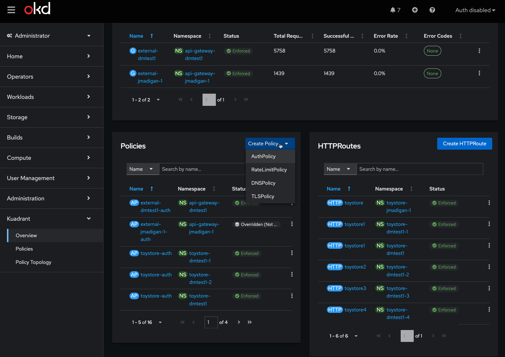

# Kuadrant OpenShift/OKD Console Plugin

See below for setup requirements.

Based on https://github.com/openshift/console-plugin-template

## Screenshots


## Running

- Target a running OCP with `oc login`
- `yarn run start` # start webpack
- `yarn run start-console` # start local ocp console + proxy

# Requirements for running locally

[Node.js](https://nodejs.org/en/) and [yarn](https://yarnpkg.com) are required
to build and run this locally. To run OpenShift console in a container, either
[Docker](https://www.docker.com) or [podman 3.2.0+](https://podman.io) and
[oc](https://console.redhat.com/openshift/downloads) are required.

## Getting started

### Option 1: Local

In one terminal window, run:

1. `yarn install`
2. `yarn run start`

In another terminal window, run:

1. `oc login` (requires [oc](https://console.redhat.com/openshift/downloads) and an [OpenShift cluster](https://console.redhat.com/openshift/create))
2. `yarn run start-console` (requires [Docker](https://www.docker.com) or [podman 3.2.0+](https://podman.io))

This will run the OpenShift console in a container connected to the cluster
you've logged into. The plugin HTTP server runs on port 9001 with CORS enabled.
Navigate to <http://localhost:9000/example> to see the running plugin.

### Option 2: oinc (no cluster required)

[oinc](https://github.com/jasonmadigan/oinc) (OKD in a container) provides a lightweight OpenShift-compatible cluster locally with the console built in. This sets up a full environment with Kuadrant, Istio, cert-manager, and the OpenShift console, with hot reloading for plugin development.

Prerequisites: [oinc](https://github.com/jasonmadigan/oinc), [kubectl](https://kubernetes.io/docs/tasks/tools/), Docker or podman, Node.js.

```bash
yarn oinc          # create cluster + start plugin dev server with hot reload
yarn oinc:teardown # tear it all down
```

Console runs at http://localhost:9000, plugin at http://localhost:9001. If the cluster already exists, `yarn oinc` skips setup and just starts the plugin server.

### Option 3: Docker + VSCode Remote Container

Make sure the
[Remote Containers](https://marketplace.visualstudio.com/items?itemName=ms-vscode-remote.remote-containers)
extension is installed. This method uses Docker Compose where one container is
the OpenShift console and the second container is the plugin. It requires that
you have access to an existing OpenShift cluster. After the initial build, the
cached containers will help you start developing in seconds.

1. Create a `dev.env` file inside the `.devcontainer` folder with the correct values for your cluster:

```bash
OC_PLUGIN_NAME=console-plugin-template
OC_URL=https://api.example.com:6443
OC_USER=kubeadmin
OC_PASS=<password>
```

2. `(Ctrl+Shift+P) => Remote Containers: Open Folder in Container...`
3. `yarn run start`
4. Navigate to <http://localhost:9000/example>

## Docker image

Before you can deploy your plugin on a cluster, you must build an image and
push it to an image registry.

1. Build the image:

```bash
docker buildx create --use
docker buildx build --platform linux/amd64,linux/arm64 -t quay.io/kuadrant/console-plugin:latest --push .
```

2. Run the image:

```bash
docker run -it --rm -d -p 9001:80 quay.io/kuadrant/console-plugin:latest
```

NOTE: If you have a Mac with Apple silicon, you will need to add the flag
`--platform=linux/amd64` when building the image to target the correct platform
to run in-cluster.

## Deployment on cluster

Two easy ways to deploy.

### Via `kubectl` or `oc`

`oc apply -f install.yaml`

or

`kubectl apply -f install.yaml`

### Via the [`kuadrant-operator`](https://www.github.com/kuadrant/kuadrant-operator)

Install via the [`kuadrant-operator`](https://www.github.com/kuadrant/kuadrant-operator). If the operator detects it is running on OKD or OpenShift, the operator will automatically configure and install the plugin. You will need to enable it in Cluster Settings.

## i18n

The plugin template demonstrates how you can translate messages in with [react-i18next](https://react.i18next.com/). The i18n namespace must match
the name of the `ConsolePlugin` resource with the `plugin__` prefix to avoid
naming conflicts. For example, the plugin template uses the
`plugin__kuadrant-console` namespace. You can use the `useTranslation` hook
with this namespace as follows:

```tsx
conster Header: React.FC = () => {
  const { t } = useTranslation('plugin__kuadrant-console-plugin');
  return <h1>{t('Hello, World!')}</h1>;
};
```

For labels in `console-extensions.json`, you can use the format
`%plugin__kuadrant-console-plugin~My Label%`. Console will replace the value with
the message for the current language from the `plugin__kuadrant-console`
namespace. For example:

```json
{
  "type": "console.navigation/section",
  "properties": {
    "id": "admin-demo-section",
    "perspective": "admin",
    "name": "%plugin__kuadrant-console-plugin~Plugin Template%"
  }
}
```

Running `yarn i18n` updates the JSON files in the `locales` folder of the
plugin template when adding or changing messages.

## Linting

This project adds prettier, eslint, and stylelint. Linting can be run with
`yarn run lint`.

The stylelint config disallows hex colors since these cause problems with dark
mode (starting in OpenShift console 4.11). You should use the
[PatternFly global CSS variables](https://patternfly-react-main.surge.sh/developer-resources/global-css-variables#global-css-variables)
for colors instead.

The stylelint config also disallows naked element selectors like `table` and
`.pf-` or `.co-` prefixed classes. This prevents plugins from accidentally
overwriting default console styles, breaking the layout of existing pages. The
best practice is to prefix your CSS classnames with your plugin name to avoid
conflicts. Please don't disable these rules without understanding how they can
break console styles!

### Linting Extensions

If you'd like to auto lint, install these VSCode extensions and configure formatting on save:

- [Prettier](https://marketplace.visualstudio.com/items?itemName=esbenp.prettier-vscode)
- [Stylelint](https://marketplace.visualstudio.com/items?itemName=stylelint.vscode-stylelint)

#### Format on save in VSCode:

Update `settings.json` (File > Preferences > Settings):

```json
"editor.formatOnSave": true
```
## Version matrix

| kuadrant-console-plugin version | PatternFly version | Openshift console version | Dynamic Plugin SDK |
|---------------------------------|--------------------|---------------------------|--------------------|
|         v0.0.3 - v0.0.18        |          5         |          v4.17.x          |       v1.6.0       |
|                TBD              |          5         |          v4.18.x          |       v1.8.0       |
|                TBD              |          6         |          v4.19.x          |         TBD        |

Openshift console is configured to share modules with its dynamic plugins (console plugins). For more information on versions and changes to the shared modules, please see the shared modules [documentation](https://www.npmjs.com/package/@openshift-console/dynamic-plugin-sdk?activeTab=readme)


## Troubleshooting

### Podman

##### What if `yarn run start-console` fails to start

```sh
yarn run start-console

Starting local OpenShift console...
[...]
Writing manifest to image destination
SIGSEGV: segmentation violation
PC=0x18021ae m=6 sigcode=1 addr=0xffffffff8c088ee0

goroutine 0 gp=0xc0001821c0 m=6 mp=0xc000180008 [idle]:
runtime.netpoll(0xc00006e000?)
	/usr/lib/golang/src/runtime/netpoll_epoll.go:169 +0x24e fp=0xffff237fdbb8 sp=0xffff237fd530 pc=0x18021ae
runtime.findRunnable()
	/usr/lib/golang/src/runtime/proc.go:3657 +0x8c5 fp=0xffff237fdd30 sp=0xffff237fdbb8 pc=0x180f765
runtime.schedule()
	/usr/lib/golang/src/runtime/proc.go:4072 +0xb1 fp=0xffff237fdd68 sp=0xffff237fdd30 pc=0x1810d31
runtime.park_m(0xc000182700)
	/usr/lib/golang/src/runtime/proc.go:4201 +0x285 fp=0xffff237fddc8 sp=0xffff237fdd68 pc=0x18111a5
runtime.mcall()
	/usr/lib/golang/src/runtime/asm_amd64.s:459 +0x4e fp=0xffff237fdde0 sp=0xffff237fddc8 pc=0x18466ee
[...]
```

##### Cause
This might happen on ARM Silicon, since one of the required images (https://quay.io/repository/openshift/origin-console) is not built for ARM arch.

##### Solution
Install in your Podman VM `qemu-user-static`

```sh
podman machine ssh [PODMAN_MACHINE_NAME]
Connecting to vm podman-machine-default. To close connection, use `~.` or `exit`
Fedora CoreOS 43.20251110.3.1
[...]
```

```sh
root@localhost:~# sudo rpm-ostree install qemu-user-static
```
Note: `[PODMAN_MACHINE_NAME]` can be omitted if you are working with the default one. Same for every example that follows.

##### However, the snippet above may fail:

```sh
root@localhost:~# sudo rpm-ostree install qemu-user-static
Updating and loading repositories:
[...]
Error: this bootc system is configured to be read-only. For more information, run `bootc --help`.
```

##### Cause
As the error well described it: The bootc system is configured to be read-only.

##### Solution
You will need to build a writeable podman machine, follow the instructions here https://github.com/containers/podman-machine-os. Note that **only works on Linux...**

##### Alternative
Try with [aptman/qus](https://github.com/dbhi/qus)

```sh
podman run --rm --privileged aptman/qus -s -- -p
✔ docker.io/aptman/qus:latest
Trying to pull docker.io/aptman/qus:latest...
Getting image source signatures
[...]
```

```sh
podman machine ssh
Connecting to vm podman-machine-default. To close connection, use `~.` or `exit`
Fedora CoreOS 43.20251110.3.1
```

```sh
root@localhost:~# cat /proc/sys/fs/binfmt_misc/qemu-x86_64
enabled
interpreter /qus/bin/qemu-x86_64-static
flags: F
offset 0
magic 7f454c4602010100000000000000000002003e00
mask fffffffffffefe00fffffffffffffffffeffffff
```

***Profit!***

## References

- [Console Plugin SDK README](https://github.com/openshift/console/tree/master/frontend/packages/console-dynamic-plugin-sdk)
- [Customization Plugin Example](https://github.com/spadgett/console-customization-plugin)
- [Dynamic Plugin Enhancement Proposal](https://github.com/openshift/enhancements/blob/master/enhancements/console/dynamic-plugins.md)
- [Console Plugin Template](https://github.com/openshift/console-plugin-template)
