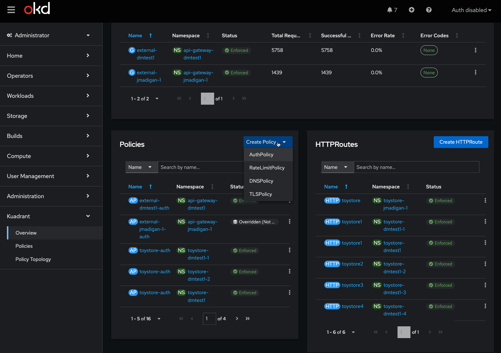

# Kuadrant OpenShift/OKD Console Plugin

See below for setup requirements.

Based on https://github.com/openshift/console-plugin-template

## Screenshots



## Running

- Target a running OCP with `oc login`
- `yarn run start` # start webpack
- `yarn run start-console` # start local ocp console + proxy

# Requirements for running locally

[Node.js](https://nodejs.org/en/) and [yarn](https://yarnpkg.com) are required
to build and run this locally. To run OpenShift console in a container, either
[Docker](https://www.docker.com) or [podman 3.2.0+](https://podman.io) and
[oc](https://console.redhat.com/openshift/downloads) are required.

## Getting started

### Option 1: Local

In one terminal window, run:

1. `yarn install`
2. `yarn run start`

In another terminal window, run:

1. `oc login` (requires [oc](https://console.redhat.com/openshift/downloads) and an [OpenShift cluster](https://console.redhat.com/openshift/create))
2. `yarn run start-console` (requires [Docker](https://www.docker.com) or [podman 3.2.0+](https://podman.io))

This will run the OpenShift console in a container connected to the cluster
you've logged into. The plugin HTTP server runs on port 9001 with CORS enabled.
Navigate to <http://localhost:9000> and click "Kuadrant" in the left sidebar menu to see the running plugin.

### Option 2: oinc (no cluster required)

[oinc](https://github.com/jasonmadigan/oinc) (OKD in a container) provides a lightweight OpenShift-compatible cluster locally with the console built in. This sets up a full environment with Kuadrant, Istio, cert-manager, and the OpenShift console, with hot reloading for plugin development.

Prerequisites: [oinc v0.5.3 or newer](https://github.com/jasonmadigan/oinc/releases/tag/v0.5.3), [kubectl](https://kubernetes.io/docs/tasks/tools/), [jq](https://jqlang.org/download/), Docker or podman, Node.js.

```bash
make oinc                   # create cluster + start plugin dev server with hot reload
make oinc-backend           # rebuild the MCP Inspector backend from the working tree
make oinc-mcp-demo          # install/refresh stateful + stateless MCP demo servers
make oinc-sync-plugin-proxy # manually resync an operator-reconciled backend proxy
make oinc-teardown          # tear it all down
```

Console runs at http://localhost:9000, plugin at http://localhost:9001. If the cluster already exists, `make oinc` skips setup and just starts the plugin server.

Setup includes the `mcp-gateway` addon to create the demo Gateway and
MCPGatewayExtension. Since [oinc v0.5.0](https://github.com/jasonmadigan/oinc/pull/33),
the addon reuses Kuadrant's MCP controller and CRDs when available; older Kuadrant
releases use a standalone Helm install. `KUADRANT_VERSION` selects the operator
version (default: `latest`), and `MCP_GATEWAY_ADDON=mcp-gateway@VERSION` can pin the
MCP chart. With bundled MCP support, Kuadrant controls the controller and broker
images; the MCP chart configures the instance only.

Version 0.5.2 includes the [fix for MCP setup with Helm 4.2.4](https://github.com/jasonmadigan/oinc/pull/37)
by downloading the chart before rendering it, keeping registry messages out of
the Kubernetes manifests.

Version 0.5.3 fixes [MCP Gateway address assignment with scoped MetalLB](https://github.com/jasonmadigan/oinc/pull/39).
Setup configures the demo Gateway's generated Service with the required
`oinc.io/metallb` class and waits for the Gateway to be programmed.

For an existing cluster created without the MCP addon, upgrade oinc and run
`oinc addon install kuadrant@latest,mcp-gateway` to add the missing instance
(replace `latest` if the cluster uses a pinned Kuadrant version). This does not
migrate an existing standalone MCP Helm release. Existing Gateways created without
infrastructure parameters need recreation because the generated Service class
must be configured at creation. Follow oinc's [Gateway migration guidance](https://github.com/jasonmadigan/oinc/blob/v0.5.3/docs/addons.md#migration-from-v043)
when retaining a cluster; for disposable clusters, recreate with the updated setup.
Save any resources you need before tearing down a cluster.

Fresh setup installs both MCP demo servers. For an existing cluster, run
`make oinc-mcp-demo`; see [demo servers](docs/mcp-inspector.md#demo-servers) for
the protocol choices, tools, prompts, and live test commands.

The MCP Inspector backend (`cmd/plugin-server`) does not run in the dev server.
oinc has no ClusterVersion, so `make oinc` sets the operator's
`CONSOLE_PLUGIN_IMAGE_OVERRIDE` and applies the plain-HTTP relay settings for
the demo gateway. A new cluster gets `quay.io/kuadrant/console-plugin:latest`,
pulled once per cluster. This needs `KUADRANT_VERSION=latest`; released
operators do not support the override yet.

The backend does not hot reload. `make oinc-backend` builds the plugin image
from the working tree, loads it into oinc and switches the backend to it;
later `make oinc` runs keep it. To return to a published image, run
`CONSOLE_PLUGIN_IMAGE=quay.io/kuadrant/console-plugin:latest make oinc`.

oinc runs Console as a standalone development container, so it does not have
the OpenShift Console operator to consume `ConsolePlugin.spec.proxy`. When the
Kuadrant Operator has reconciled a proxy, `make oinc` automatically translates
it into the standalone Console configuration. Use
`make oinc-sync-plugin-proxy` to resync manually if the backend Service changes
while the development environment is already running. This is development glue
only; the Kuadrant Operator remains the source of truth for production plugin
resources. The sync command requires the `oinc` context and refreshes a separate
development-only NetworkPolicy allowing the current Console container IP to the
backend on TCP 9443. It then checks backend health through Console. Re-run it
after recreating Console; see [network access](docs/mcp-inspector.md#network-access)
for runtime/CNI limitations. Set `OINC_BIN` if the required oinc binary is not on `PATH`.

### Option 3: Docker + VSCode Remote Container

Make sure the
[Remote Containers](https://marketplace.visualstudio.com/items?itemName=ms-vscode-remote.remote-containers)
extension is installed. This method uses Docker Compose where one container is
the OpenShift console and the second container is the plugin. It requires that
you have access to an existing OpenShift cluster. After the initial build, the
cached containers will help you start developing in seconds.

1. Create a `dev.env` file inside the `.devcontainer` folder with the correct values for your cluster:

```bash
OC_PLUGIN_NAME=kuadrant-console-plugin
OC_URL=https://api.example.com:6443
OC_USER=kubeadmin
OC_PASS=<password>
```

2. `(Ctrl+Shift+P) => Remote Containers: Open Folder in Container...`
3. `yarn run start`
4. Navigate to <http://localhost:9000> and click "Kuadrant" in the left sidebar menu

## Docker image

Before you can deploy your plugin on a cluster, you must build an image and
push it to an image registry.

1. Build the image:

```bash
docker buildx create --use
docker buildx build --platform linux/amd64,linux/arm64 -t quay.io/kuadrant/console-plugin:latest --push .
```

2. Run the image:

Save the Kubernetes API's trusted CA bundle as `kubernetes-ca.crt` in the current
directory. Use an API URL reachable from the container:

```bash
docker run -it --rm -d -p 9001:9443 \
  --mount type=bind,source="${PWD}/kubernetes-ca.crt",target=/var/kubernetes-ca.crt,readonly \
  -e KUBERNETES_CA_FILE=/var/kubernetes-ca.crt \
  -e KUBERNETES_API_URL=https://api.example.com:6443 \
  quay.io/kuadrant/console-plugin:latest
```

For static-asset-only development, you may explicitly opt out of API certificate
verification with `-e KUBERNETES_INSECURE_SKIP_TLS_VERIFY=true` instead of mounting
the CA. Do not use that override with real Console credentials or in-cluster.
MCP proxying uses admin-managed Gateway and extension destinations by default.
See the [Inspector backend settings](docs/mcp-inspector.md#backend-settings) for
optional origin restrictions and private-CA support.

NOTE: If you have a Mac with Apple silicon, you will need to add the flag
`--platform=linux/amd64` when building the image to target the correct platform
to run in-cluster.

## Deployment on cluster

Two easy ways to deploy.

### Via `kubectl` or `oc`

`install.yaml` uses the 4.22+ `latest` image. For OCP 4.21 and earlier, replace
it with `quay.io/kuadrant/console-plugin:v0.6.0` before applying the manifest.

`oc apply -f install.yaml`

or

`kubectl apply -f install.yaml`

### Via the [`kuadrant-operator`](https://www.github.com/kuadrant/kuadrant-operator)

Install via the [`kuadrant-operator`](https://www.github.com/kuadrant/kuadrant-operator). If the operator detects it is running on OKD or OpenShift, the operator will automatically configure and install the plugin. You will need to enable it in Cluster Settings.

## i18n

The plugin demonstrates how you can translate messages with [react-i18next](https://react.i18next.com/). The i18n namespace must match
the name of the `ConsolePlugin` resource with the `plugin__` prefix to avoid
naming conflicts. For example, this plugin uses the
`plugin__kuadrant-console-plugin` namespace. You can use the `useTranslation` hook
with this namespace as follows:

```tsx
const Header: React.FC = () => {
  const { t } = useTranslation('plugin__kuadrant-console-plugin');
  return <h1>{t('Hello, World!')}</h1>;
};
```

For labels in `console-extensions.json`, you can use the format
`%plugin__kuadrant-console-plugin~My Label%`. Console will replace the value with
the message for the current language from the `plugin__kuadrant-console-plugin`
namespace. For example:

```json
{
  "type": "console.navigation/section",
  "properties": {
    "id": "admin-demo-section",
    "perspective": "admin",
    "name": "%plugin__kuadrant-console-plugin~Kuadrant%"
  }
}
```

Running `yarn i18n` updates the JSON files in the `locales` folder of the
plugin when adding or changing messages.

## Linting

This project adds prettier, eslint, and stylelint. Linting can be run with
`yarn run lint`.

The stylelint config disallows hex colors since these cause problems with dark
mode (starting in OpenShift console 4.11). You should use the
[PatternFly global CSS variables](https://patternfly-react-main.surge.sh/developer-resources/global-css-variables#global-css-variables)
for colors instead.

The stylelint config also disallows naked element selectors like `table` and
`.pf-` or `.co-` prefixed classes. This prevents plugins from accidentally
overwriting default console styles, breaking the layout of existing pages. The
best practice is to prefix your CSS classnames with your plugin name to avoid
conflicts. Please don't disable these rules without understanding how they can
break console styles!

### Linting Extensions

If you'd like to auto lint, install these VSCode extensions and configure formatting on save:

- [Prettier](https://marketplace.visualstudio.com/items?itemName=esbenp.prettier-vscode)
- [Stylelint](https://marketplace.visualstudio.com/items?itemName=stylelint.vscode-stylelint)

#### Format on save in VSCode:

Update `settings.json` (File > Preferences > Settings):

```json
"editor.formatOnSave": true
```

## Version matrix

| OpenShift console | Image    | Branch        |
| ----------------- | -------- | ------------- |
| 4.21 and earlier  | `v0.6.0` | `release-0.x` |
| 4.22 and later    | `v0.7.0` | `main`        |

`v0.6.0` declares `latestSupportedOpenshiftVersion: "4.19"`, but is supported
through 4.21. The `release-0.x` branch corrects the metadata and receives
backports.

`v0.7.0` is the stable 4.22+ release; `latest` tracks development on `main`.
Choose the image by OpenShift version, not by which tag looks newest.

See [Versioning and OpenShift compatibility](docs/versioning.md) for runtime
versions and loading rules.

## Maintenance

### Cleaning up Quay tags

`scripts/delete-quay-tags.sh` deletes transient tags from a Quay repository (default: `quay.io/kuadrant/console-plugin`), keeping only `latest`, `main`, and semantic version tags prefixed with `v` (e.g. `v0.5.0`).

**Tag listing** uses skopeo with the Docker/Podman auth file (`docker login quay.io`).
**Tag deletion** uses the Quay.io REST API (OAuth2), which requires a separate access token.

To generate the OAuth token:

1. Log in to quay.io → (Account or Org) Settings → Applications
2. Create an application, click **Generate Token**, tick **Administer Repositories**
3. Copy the token

```bash
docker login quay.io   # for tag listing via skopeo
QUAY_TOKEN=<oauth-token> ./scripts/delete-quay-tags.sh
```

Set `DRY_RUN=true` to preview what would be deleted without removing anything:

```bash
DRY_RUN=true QUAY_TOKEN=<oauth-token> ./scripts/delete-quay-tags.sh
```

To target a different repository:

```bash
REPO=quay.io/myorg/myrepo QUAY_TOKEN=<oauth-token> ./scripts/delete-quay-tags.sh
```

To use a non-default auth file:

```bash
AUTHFILE=~/.config/containers/auth.json QUAY_TOKEN=<oauth-token> ./scripts/delete-quay-tags.sh
```

Deletions are confirmed interactively in batches of 25.

## References

- [Console Plugin SDK README](https://github.com/openshift/console/tree/master/frontend/packages/console-dynamic-plugin-sdk)
- [Customization Plugin Example](https://github.com/spadgett/console-customization-plugin)
- [Dynamic Plugin Enhancement Proposal](https://github.com/openshift/enhancements/blob/master/enhancements/console/dynamic-plugins.md)
- [Console Plugin Template](https://github.com/openshift/console-plugin-template)

## Troubleshooting

For troubleshooting common issues, please see [TROUBLESHOOTING.md](TROUBLESHOOTING.md).
