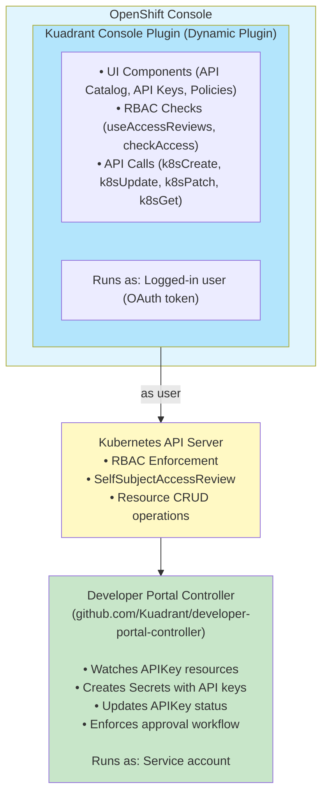

# Feature: API Management RBAC

## Summary

This design defines the RBAC system for developer portal capabilities in the Kuadrant Console Plugin. Unlike the Backstage plugin which uses ownership-based permissions (`backstage.io/owner` annotations), the console plugin uses **OpenShift's namespace-based RBAC** to control access to API products, API keys, kuadrant policies and Gateway API resources like HTTPRoutes and Gateways.

The design introduces three personas (API Consumer, API Owner, API Admin) with distinct permissions, leveraging Kubernetes native RBAC (Roles, ClusterRoles, RoleBindings, ClusterRoleBindings) to enforce access control. All operations are performed as the logged-in user via the OpenShift Console's authentication system.

**Persona hierarchy:**

- **API Consumer**: Namespace-scoped APIKey management + cluster-wide catalog browsing
- **API Owner**: Namespace-scoped API management (APIProducts, APIKeyApprovals, APIKeyRequests) + cluster-wide catalog browsing (APIProducts, policies, routes)
- **API Admin**: API Owner with cluster-wide permissions (ClusterRoleBinding) + additional troubleshooting capabilities (APIKeys/APIKeyRequests write access)

## Goals

- Define RBAC roles for three core personas: API Consumer, API Owner, and API Admin
- Enable namespace-based isolation for API product management
- Provide clear permission boundaries using standard Kubernetes RBAC mechanisms
- Document deployment patterns for different organizational structures
- Create validation procedures to test RBAC implementation

## Non-Goals

- Custom authorization logic beyond Kubernetes RBAC
- Backend service accounts (all operations use logged-in user's permissions)
- Automated RBAC provisioning
- Developer Portal Controller RBAC (separate concern, controller has its own service account)

## Design

### Backwards Compatibility

**Breaking changes to APIKey CRD** (`devportal.kuadrant.io/v1alpha1`):

- `status.phase` → `status.conditions` (following Kubernetes conditions pattern)
- Removed status fields: `secretRef`, `canReadSecret`, `reviewedBy`, `reviewedAt`, `apiKeyValue`
- Added required fields: `spec.apiProductRef.namespace` (cross-namespace reference), `spec.secretRef` (namespace-local reference to consumer's secret)

**No migration required**: The current v1alpha1 API is in dev preview support mode, so breaking changes are acceptable. Consider bumping the API version to `v1alpha2` to signal these breaking changes to users.

**New RBAC roles are additive** (no breaking changes to existing roles):

- New ClusterRoles: `api-consumer`, `api-owner`, `api-admin`
- New CRD: `APIKeyApproval` (`devportal.kuadrant.io/v1alpha1`)
- New focus on API Management resources: `APIProduct`, `APIKey`, `APIKeyApproval`

All policies (PlanPolicy, AuthPolicy, RateLimitPolicy) are treated uniformly with read-only access for the new three personas.

### Architecture

#### Component Relationships



**Key architectural principles:**

- The console plugin uses OpenShift's namespace-based RBAC.
- All operations are performed as the logged-in user via the OpenShift Console's authentication system.
- The console plugin is UI for better user experience. UI elements hidden/disabled based on permission checks. But all the workflows must be allowed using kubectl clients, enabling so called gitops.
- Catalog visibility: All personas have cluster-wide read access to enable API discovery. Restrictions on catalog visibility not considered in this design.
- Console plugin has NO backend - all operations via OpenShift Console's Kubernetes API proxy
- User identity is preserved - all API calls made with logged-in user's OAuth token
- RBAC enforced by Kubernetes - not just UI hints
- Only owners should have permissions to approve/reject api requests (APIKey objects)
- Consumers must not have secret read permissions out of their namespaces
- Consumer creates secret with API key in their namespace, referenced from APIKey spec.secretRef
- Consumers must have access only to their own api keys.
- Owners must only see API access requests for their own API products (enforced by namespace boundaries via APIKeyRequest shadow resources)
- Owners and admins must not have access to API key values in consumer secrets (security isolation)

### API Changes

This design requires changes to existing CRDs and introduces new CRDs:

**New CRDs**:

- **APIKeyApproval** (`devportal.kuadrant.io/v1alpha1`) - Resource for approval/rejection workflow
- **APIKeyRequest** (`devportal.kuadrant.io/v1alpha1`) - Shadow resource auto-created by controller in owner's namespace to enable RBAC-enforced request discovery

**Modified CRDs**:

- **APIKey** (`devportal.kuadrant.io/v1alpha1`) - Add `spec.apiProductRef.namespace`, add `spec.secretRef`, change `status.phase` to `status.conditions`, remove several status fields including `status.apiKeyValue`

**Existing Resources** (no changes):

- **APIProduct**: Defined and managed by the [Developer Portal Controller](https://github.com/Kuadrant/developer-portal-controller)
- **PlanPolicy**, **AuthPolicy**, and **RateLimitPolicy**: Defined and managed by [Kuadrant Operator](https://github.com/Kuadrant/kuadrant-operator)
- **HTTPRoute**: Part of Kubernetes Gateway API

This design defines RBAC roles for console plugin users to interact with these resources.

### API Access Request Workflow

This section describes the high-level workflow for consumers to request and receive API access.

#### Workflow Steps

1. **Consumer browses catalog** - Consumer discovers published APIs across namespaces (cluster-wide read access to APIProducts)

2. **Consumer creates secret** - Consumer creates Secret containing the API key in **their own namespace** (frontend app generates key and creates secret, or user creates declaratively for GitOps)

3. **Consumer requests access** - Consumer creates APIKey resource in **their own namespace** with `spec.secretRef` referencing the secret and cross-namespace reference to APIProduct in owner's namespace

4. **APIKey enters Pending state** - The newly created APIKey has no conditions (`conditions: []`), indicating it's awaiting approval

5. **Controller creates shadow resource** - Controller automatically creates **APIKeyRequest** resource in **owner's namespace** (mirroring the APIKey request for RBAC-enforced discovery)

6. **Owner discovers requests** - API Owner lists APIKeyRequest resources in **their own namespace** (namespace-scoped, RBAC-enforced - owners only see requests for their API products)

7. **Approval decision**:
   - **Automatic mode**: Controller automatically creates APIKeyApproval resource in **owner's namespace** with `approved: true` and `reviewedBy: "system"` (no owner action needed)
   - **Manual mode**: API Owner creates APIKeyApproval resource in **their own namespace** with cross-namespace reference to consumer's APIKey

8. **Controller reconciles approval** - Controller reads APIKeyApproval and updates APIKey `status.conditions` (Approved or Denied based on `spec.approved` field)

9. **On approval**: When APIKeyApproval exists with `approved: true` (either auto-created or manually created), controller reads API key from consumer's secret (spec.secretRef) and creates Secret in **kuadrant namespace** with the API key value plus policy enforcement metadata (centralized secret storage, makes API key effective for traffic)

10. **Consumer retrieves API key** - Consumer accesses the API key value from their Secret in their own namespace (has secret read permissions in own namespace)

11. **Consumer uses API** - Consumer authenticates API requests using the retrieved key

#### Key Architectural Decisions

**1. APIKey in Consumer's Namespace**

**Problem**: If APIKeys are in owner's namespace, Consumer A can see Consumer B's API keys (architectural principle: "Consumers must have access only to their own api keys").

**Solution**:

- Consumer creates APIKey in **their own namespace**
- APIKey references APIProduct via `spec.apiProductRef.namespace` (cross-namespace reference)
- Kubernetes RBAC naturally enforces consumer isolation via namespace boundaries
- API key value projected to `status.apiKeyValue` is only accessible in consumer's namespace

**2. APIKeyRequest Shadow Resource for RBAC-Enforced Discovery**

**Problem**: Kubernetes RBAC cannot filter resources by field values. If owners have cluster-wide read on APIKeys, they can see ALL requests (not just for their APIs) AND can read `status.apiKeyValue` for all consumer APIKeys (security violation).

**Solution**:

- Controller automatically creates **APIKeyRequest** resource in **owner's namespace** when APIKey is created
- APIKeyRequest is a lightweight mirror containing request metadata (requestedBy, useCase, planTier) but NOT apiKeyValue
- Owner has: `get/list apikeyrequests` permission in their namespace only (namespace-scoped via RoleBinding)
- Owner does NOT have: cluster-wide read on `apikeys` (no access to consumer APIKeys or apiKeyValue)
- **RBAC-enforced discovery**: Namespace boundaries ensure owners only see requests for their API products
- **Security isolation**: Owners never interact with APIKey resources directly, cannot access apiKeyValue
- **Explicit cleanup required**: OwnerReferences cannot be cross-namespace. Controller must explicitly handle cleanup when APIKey is deleted, ensuring corresponding APIKeyRequest in owner's namespace is also removed.
- Controller manages APIKeyRequest lifecycle automatically (create, sync status, delete on APIKey deletion)

**3. APIKeyApproval CRD for Approval Workflow**

**Problem**: Kubernetes RBAC cannot enforce field-level permissions. If consumers update `status`, they could set approval conditions themselves.

**Solution**:

- **APIKeyApproval resource created in owner's namespace** (by owner for manual mode, by controller for automatic mode)
- APIKeyApproval references APIKey via `spec.apiKeyRef.namespace` (cross-namespace reference)
- Owner has: `create apikeyapprovals` permission in their namespace
- Consumer does NOT have: `create apikeyapprovals` permission (no access to owner's namespace)
- Controller derives `status.conditions` (Approved/Denied) from APIKeyApproval `spec.approved` field
- **No validation webhook needed** - Clean RBAC separation via namespaces

**Why always create APIKeyApproval (even in automatic mode)?**

- ✅ **Unified revocation mechanism**: Owners revoke ANY approved key (automatic or manual) by editing APIKeyApproval (`approved: false`)
- ✅ **Stable across mode changes**: Switching `automatic ↔ manual` doesn't affect existing approved APIKeys
- ✅ **Historical record**: APIKeyApproval proves "this was approved under the rules at the time" (decoupled from current approval mode)
- ✅ **Audit trail**: Distinguishes auto-approved (`reviewedBy: "system"`) from manually approved (`reviewedBy: "owner@example.com"`)
- ✅ **Simpler controller**: Single reconciliation path - always check for APIKeyApproval (no dual approval logic)
- ✅ **Prevents unexpected breaks**: Active API consumers remain approved when approval mode changes (prevents `automatic → manual` causing all keys to become Pending)

**4. Consumer-Provided Secrets with Centralized Policy Enforcement Storage**

**Problem**: Where should API key secrets be stored and who creates them? Options include controller-generated vs consumer-provided, and where to store for policy enforcement.

**Solution**:

- Consumer creates secret with API key in **their own namespace** (frontend generates and creates, or declarative for GitOps)
- APIKey spec references consumer's secret via `spec.secretRef` (namespace-local reference)
- On approval, controller reads API key from consumer's secret and creates enforcement secret in **kuadrant namespace**
- **Benefits**:
  - No backend needed - frontend can generate key and create secret directly
  - GitOps-friendly - users can declaratively define APIKey and secret together
  - Consumer has access anytime - has secret read permissions in own namespace
  - Simplified UI - frontend shows key once, consumer accepts, creates secret + APIKey
- **Trade-offs**:
  - API key duplicated in two secrets (consumer's namespace and kuadrant namespace)
- **Clean separation** - Consumer owns their secret, controller manages policy enforcement secret

**5. Conditions Pattern (Following CertificateSigningRequest)**

- Replace `status.phase` with `status.conditions` array
- **Lifecycle states**:
  - `Pending`: The initial state. An APIKey is "Pending" if it has no conditions of type `Approved`, `Denied`, or `Failed`
  - `Approved`: Condition type set to "True" when approved (via APIKeyApproval or automatic mode)
  - `Denied`: Condition type set to "True" when rejected (via APIKeyApproval)
  - `Failed`: Condition type set to "True" when controller encounters an error
- Remove `status.reviewedBy`, `status.reviewedAt` - moved to APIKeyApproval spec

### API Management Resources

This section describes the key resources managed by the RBAC roles and their implications for permission design.

#### APIKey Resource (devportal.kuadrant.io/v1alpha1)

The `APIKey` resource is the core of the consumer access request workflow. Consumers create APIKeys to request access to published APIs.

```yaml
apiVersion: devportal.kuadrant.io/v1alpha1
kind: APIKey
metadata:
  name: mobile-app-payment-key
  namespace: consumer-team-mobile  # Consumer's own namespace
spec:
  # Cross-namespace reference to APIProduct
  apiProductRef:
    name: payment-api-v1
    namespace: payment-services  # Owner's namespace

  # Reference to secret containing API key (namespace-local reference)
  # Consumer creates this secret in their own namespace before creating APIKey
  # Controller reads API key from this secret on approval
  secretRef:
    name: mobile-app-payment-key-secret

  # Rate limiting plan tier
  planTier: "basic"  # e.g., "free", "basic", "premium", "enterprise"

  # Who requested this API key
  requestedBy:
    userId: "alice"
    email: "alice@mobile-team.example.com"

  # Use case justification
  useCase: "Mobile app integration for payment processing in our iOS/Android apps"

status:
  # Approval conditions (following CertificateSigningRequest pattern)
  # Lifecycle states:
  #   - Pending: No conditions (initial state after creation)
  #   - Approved: Approved condition with status "True"
  #   - Denied: Denied condition with status "True"
  #   - Failed: Failed condition with status "True"

  # Example: Approved state
  conditions:
    - type: Approved
      status: "True"
      reason: "ApprovedByOwner"
      message: "Approved for mobile team's payment integration project"
      lastTransitionTime: "2026-03-30T14:00:00Z"

    # OR for Denied state:
    # - type: Denied
    #   status: "True"
    #   reason: "RejectedByOwner"
    #   message: "API product not available for external use"
    #   lastTransitionTime: "2026-03-30T14:00:00Z"

    # OR for Pending state (initial):
    # conditions: []  # Empty array = Pending state

  # Rate limits from selected plan
  limits:
    daily: 10000
    monthly: 300000
    custom:
      - limit: 100
        window: 1m

  # Authentication scheme
  authScheme:
    credentials:
      authorizationHeader:
        prefix: "Bearer"
    authenticationSpec:
      selector:
        matchLabels:
          kuadrant.io/apikey: mobile-app-payment-key

  # API hostname from HTTPRoute
  apiHostname: "api.payment.example.com"
```

**RBAC implications:**

- **Namespace placement**: APIKey created in **consumer's own namespace** (not owner's namespace)
- **Cross-namespace reference**: `spec.apiProductRef.namespace` references APIProduct in owner's namespace
- **Consumer isolation**: Each consumer only has permissions in their own namespace, preventing access to other consumers' API keys (architectural principle)
- **Secret reference**: `spec.secretRef` references secret in consumer's own namespace (namespace-local reference)
- **Approval workflow**:
  - API Owners create APIKeyApproval resource in their own namespace (manual mode only)
  - APIKeyApproval contains cross-namespace reference to consumer's APIKey
  - Consumers cannot approve/reject (architectural principle: consumers cannot create APIKeyApproval)
  - Controller reconciles approval and updates `status.conditions` based on APIKeyApproval or automatic mode
- **Conditions pattern** (following CertificateSigningRequest):
  - `Pending`: Initial state with no conditions (empty array)
  - `Approved` condition: Set to "True" when approved
  - `Denied` condition: Set to "True" when rejected
  - `Failed` condition: Set to "True" on controller errors
  - Conditions set by controller only, not by users
- **Secret management**:
  - Consumer creates Secret with API key in **their own namespace** before creating APIKey
  - Consumer has **secret read permissions in their own namespace** (can access API key anytime)
  - On approval, controller reads API key from consumer's secret (spec.secretRef) and creates enforcement Secret in **kuadrant namespace**
  - **API key duplicated** in two secrets: consumer's namespace (access) and kuadrant namespace (policy enforcement)
  - **Benefits**: No backend needed, GitOps-friendly, consumer owns their secret

#### APIProduct Resource (devportal.kuadrant.io/v1alpha1)

API Owners publish APIProducts to make their APIs discoverable in the developer portal catalog.

```yaml
apiVersion: devportal.kuadrant.io/v1alpha1
kind: APIProduct
metadata:
  name: payment-api-v1
  namespace: payment-services
spec:
  displayName: "Payment API v1"
  description: "Process payments and manage transactions"
  version: "v1"

  # Approval mode (determines if manual approval needed)
  approvalMode: manual  # "manual" | "automatic"

  # Visibility in catalog
  publishStatus: Published  # "Draft" | "Published"

  tags:
    - payments
    - fintech

  # Reference to HTTPRoute
  targetRef:
    group: gateway.networking.k8s.io
    kind: HTTPRoute
    name: payment-api-route

  documentation:
    url: "https://docs.example.com/payment-api"
```

**RBAC implications:**

- **Namespace ownership**: API Owners can only create/update/delete APIProducts in their assigned namespaces
- **Catalog visibility**: All personas have cluster-wide read access to enable API discovery
- **Approval workflow**:
  - `approvalMode: automatic` → Controller automatically creates APIKeyApproval with `approved: true` and `reviewedBy: "system"` (no owner intervention required for initial approval)
  - `approvalMode: manual` → Owner creates APIKeyApproval resource to approve/reject consumer requests
  - **Revocation**: In both modes, owners can revoke by editing APIKeyApproval (`approved: false`) - controller sets Denied condition and removes enforcement Secret
  - **Mode changes**: Existing APIKeyApprovals remain valid when switching modes - approval state is decoupled from current approval mode
- **Draft products**: `publishStatus: Draft` can be used to hide products from catalog while in development (UI can filter by this field)
- **HTTPRoute reference**: `spec.targetRef` must reference an HTTPRoute in the same namespace (namespace-local reference)
- **Owner permissions**: Requires `create apiproducts` permission in namespace, plus `get httproutes` to select valid routes

#### APIKeyApproval Resource (devportal.kuadrant.io/v1alpha1)

APIKeyApproval resources record approval decisions for consumer API access requests. They are created either:

- **Automatically** by the controller when `APIProduct.spec.approvalMode = automatic`
- **Manually** by API Owners when `APIProduct.spec.approvalMode = manual`

```yaml
apiVersion: devportal.kuadrant.io/v1alpha1
kind: APIKeyApproval
metadata:
  name: mobile-app-payment-key-approval
  namespace: payment-services  # Owner's namespace (same as APIProduct)
spec:
  # Cross-namespace reference to the APIKey being approved/rejected
  apiKeyRef:
    name: mobile-app-payment-key
    namespace: consumer-team-mobile  # Consumer's namespace

  # Approval decision
  approved: true  # true = Approved, false = Rejected/Denied

  # Who made the decision
  # "system" for automatic approvals, user email for manual approvals
  reviewedBy: "bob@payment-team.com"

  # When the decision was made
  reviewedAt: "2026-03-30T14:00:00Z"

  # Reason for decision
  reason: "ApprovedByOwner"

  # Review notes/message
  message: "Approved for mobile team's payment integration project. Contact us if you need higher limits."
```

**Example: Automatic Approval**

```yaml
apiVersion: devportal.kuadrant.io/v1alpha1
kind: APIKeyApproval
metadata:
  name: mobile-app-payment-key-approval
  namespace: payment-services
spec:
  apiKeyRef:
    name: mobile-app-payment-key
    namespace: consumer-team-mobile
  approved: true
  reviewedBy: "system"  # Auto-generated by controller
  reviewedAt: "2026-03-30T13:46:00Z"
  reason: "AutomaticApproval"
  message: "Automatically approved based on APIProduct approval mode"
```

**RBAC implications:**

- **Creation modes**:
  - **Automatic mode**: Controller creates APIKeyApproval with `approved: true` and `reviewedBy: "system"`
  - **Manual mode**: API Owners create APIKeyApproval to approve/reject requests
- **Owner permissions**: Owners can create/update/delete APIKeyApproval resources in their namespace
- **Namespace placement**: APIKeyApproval created in **owner's namespace** (same as APIProduct)
- **Cross-namespace reference**: `spec.apiKeyRef.namespace` references APIKey in consumer's namespace
- **Review metadata**: All approval/rejection metadata stored in APIKeyApproval (reviewedBy, reviewedAt, reason, message)
- **Controller reconciliation**:
  - Controller watches APIKeyApproval resources cluster-wide
  - **Validation**: Controller verifies APIKeyApproval namespace matches the APIProduct namespace referenced in the APIKey
    - If namespaces don't match: Sets `Failed` condition with reason "InvalidApproval" (prevents cross-namespace approval attacks)
    - This ensures owners can only approve requests for API products they own
  - If `spec.approved = true` and validation passes: Sets `Approved` condition to "True" in APIKey status and creates Secret
  - If `spec.approved = false`: Sets `Denied` condition to "True" in APIKey status
  - If no APIKeyApproval exists: No approval/denial conditions set (pending state)
  - Copies `reviewedBy`, `reason`, `message` into condition fields
- **Revocation workflow**:
  - Owner edits APIKeyApproval: `approved: false` → controller sets `Denied` condition, deletes enforcement Secret
  - Works identically for automatic and manual approvals (unified revocation mechanism)
- **Clean RBAC separation**:
  - Consumers have `create/update/delete apikeys` permissions in their own namespace
  - Consumers do NOT have `create apikeyapprovals` permissions (no access to owner's namespace)
  - **No validation webhook needed** - Kubernetes RBAC enforces separation via namespaces
- **Approval mode changes**:
  - Existing APIKeyApprovals remain valid when switching `automatic ↔ manual`
  - Approval state is decoupled from current approval mode (historical record of approval at a point in time)
  - Prevents unexpected state changes to active API consumers

#### APIKeyRequest Resource (devportal.kuadrant.io/v1alpha1)

**Shadow resource** automatically created by the Developer Portal Controller in the owner's namespace to enable RBAC-enforced request discovery without exposing API key values.

```yaml
apiVersion: devportal.kuadrant.io/v1alpha1
kind: APIKeyRequest
metadata:
  name: mobile-app-payment-key-request
  namespace: payment-services  # Owner's namespace (same as APIProduct)
  # NOTE: ownerReferences cannot be cross-namespace
  # Controller must explicitly handle cleanup when APIKey is deleted
spec:
  # Cross-namespace reference to original APIKey in consumer's namespace
  apiKeyRef:
    name: mobile-app-payment-key
    namespace: consumer-team-mobile

  # Copied from APIKey.spec for display purposes (read-only for owners)
  requestedBy:
    userId: "alice"
    email: "alice@mobile-team.example.com"

  useCase: "Mobile app integration for payment processing"
  planTier: "basic"

  # Reference to APIProduct (for UI context, redundant with namespace placement)
  apiProductRef:
    name: payment-api-v1
    namespace: payment-services  # Same as APIKeyRequest.metadata.namespace

status:
  # Synced from original APIKey.status.conditions by controller
  # Does NOT include apiKeyValue (security isolation)
  conditions:
    - type: Pending
      status: "True"
      lastTransitionTime: "2026-03-30T13:45:00Z"

    # OR when approved/denied:
    # - type: Approved
    #   status: "True"
    #   reason: "ApprovedByOwner"
    #   message: "Approved for mobile team's payment integration project"
    #   lastTransitionTime: "2026-03-30T14:00:00Z"
```

**RBAC implications:**

- **Controller-managed lifecycle**: APIKeyRequest resources are automatically created/updated/deleted by the controller - owners and consumers do NOT create these resources directly
- **Namespace placement**: Created in **owner's namespace** (same as APIProduct) to enable namespace-scoped RBAC
- **RBAC-enforced discovery**: Owners have `get/list apikeyrequests` permission in their own namespace only (namespace-scoped via RoleBinding)
- **Security isolation**: APIKeyRequest does NOT contain `status.apiKeyValue` - owners cannot see API key values
- **Cross-namespace reference**: `spec.apiKeyRef.namespace` references original APIKey in consumer's namespace
- **Status synchronization**: Controller syncs conditions from APIKey to APIKeyRequest, excluding apiKeyValue
- **Explicit cleanup required**: OwnerReferences cannot be cross-namespace. Controller must explicitly handle APIKey deletions and remove corresponding APIKeyRequest resources in owner's namespace.
- **Request metadata**: Contains requestedBy, useCase, planTier for owner review (copied from APIKey.spec)
- **Owner workflow**:
  1. Owner lists APIKeyRequest resources in their own namespace (namespace-scoped, RBAC-enforced)
  2. Owner reviews request metadata (who, why, which plan tier)
  3. Owner creates APIKeyApproval in their namespace to approve/reject
  4. Controller updates both APIKey (consumer's namespace) and APIKeyRequest (owner's namespace) with approval decision
- **No cluster-wide access needed**: Owners never need cluster-wide read on APIKeys - namespace boundaries enforce that owners only see requests for their API products

#### Policy and Route Resources

In addition to APIProduct and APIKey, API consumers need read-only access to policies and routes to understand API requirements, endpoints, and rate limits.

**Policies** (all read-only for consumers and owners)

1. **PlanPolicy** (`extensions.kuadrant.io/v1alpha1`)
   - Platform-managed rate limiting plan templates
   - Defines tiers (e.g., free, basic, premium, enterprise)

2. **AuthPolicy** (`kuadrant.io/v1`)
   - Authentication and authorization requirements
   - Shows what credentials are needed (API key, OAuth, JWT, etc.)
   - Applied to HTTPRoutes or Gateways

3. **RateLimitPolicy** (`kuadrant.io/v1`)
   - Route-specific rate limiting configurations
   - May differ from PlanPolicy defaults
   - Shows actual limits applied to specific APIs

**Routes**

1. **HTTPRoute** (`gateway.networking.k8s.io/v1`)
   - API endpoints, paths, and HTTP methods
   - Hostname and path prefixes
   - Backend service references
   - Referenced by APIProduct via `spec.targetRef`

**RBAC implications:**

- All policies and routes: consumers, owners, and admins have cluster-wide read-only access
- Owners may have write access to these resources in their own namespaces (separate policy management roles)
- Admins have the same read-only access as owners (no write access to policies/routes via API Management roles)

### Security Considerations

#### 1. Namespace Isolation

**Consumer isolation via namespaces:**

- Consumer A creates APIKeys in `consumer-team-mobile` namespace
- Consumer B creates APIKeys in `consumer-team-backend` namespace
- Each consumer only has permissions in their own namespace
- **Security guarantee**: Kubernetes RBAC enforces that Consumer A cannot access Consumer B's APIKeys
- **API key value protection**: `status.apiKeyValue` is only readable in consumer's own namespace
- **No cross-consumer leakage**: Architectural principle "Consumers must have access only to their own api keys" enforced by namespace boundaries

#### 2. Consumer-Managed Secrets and Owner Isolation

**API key delivery via consumer's secret:**

- Consumer creates Secret with API key in **their own namespace** before creating APIKey
- Consumer has **secret read permissions in their own namespace** (can access API key anytime)
- APIKey references consumer's secret via `spec.secretRef` (namespace-local reference)
- On approval, controller reads API key from consumer's secret and creates enforcement Secret in **kuadrant namespace**
- **Security benefit**: Consumer owns their secret, can access anytime, GitOps-friendly
- **Frontend workflow**: Frontend generates key, shows to user once, on acceptance creates secret + APIKey
- **GitOps workflow**: User declaratively creates secret and APIKey together
- **Trade-off**: API key duplicated in two secrets (consumer's namespace for access, kuadrant namespace for policy enforcement)
- Centralized secret management in kuadrant namespace simplifies policy enforcement
- Owners do not need secret read permissions in consumer namespaces (secrets managed by consumers)

**Owner isolation from API key values:**

- **Problem**: Kubernetes RBAC cannot filter by field values. If owners have cluster-wide read on APIKeys or Secrets, they can access consumer API keys.
- **Solution**: APIKeyRequest shadow resource pattern + namespace isolation
  - Controller creates APIKeyRequest in **owner's namespace** when consumer creates APIKey
  - APIKeyRequest contains request metadata (requestedBy, useCase, planTier) but NOT secret references
  - Owners have `get/list apikeyrequests` permission in their namespace only (namespace-scoped via RoleBinding)
  - Owners do NOT have `get/list apikeys` permission (no access to consumer APIKeys)
  - Owners do NOT have `get secrets` permission in consumer namespaces (cannot read consumer secrets)
  - **RBAC-enforced discovery**: Namespace boundaries ensure owners only see requests for their API products
  - **Security isolation**: Owners never interact with APIKey or Secret resources in consumer namespaces
- **Admin exception**: Admins retain cluster-wide read on APIKeys for troubleshooting, but still do NOT have secret read permissions in consumer namespaces (consumer secrets remain isolated). Admins are trusted platform operators expected to follow organizational policies regarding access to sensitive data.

**Secret rotation and revocation:**

- **Consumer rotation**: Consumer deletes old APIKey and creates new one with new secret
- **Owner revocation**: Owner edits APIKeyApproval (`approved: false`)
  - Controller updates APIKey conditions (sets `Denied`)
  - Controller deletes enforcement Secret from kuadrant namespace
  - Consumer's secret remains (consumer manages their own secrets)
  - Works identically for automatic and manual approvals

#### 3. Approval Enforcement

**Automatic approval mode:**

- `APIProduct.spec.approvalMode: automatic` → Controller creates APIKeyApproval with `approved: true` and `reviewedBy: "system"`
- **Risk**: Owner accidentally sets automatic mode for sensitive API
- **Mitigation**:
  - Document approval modes clearly, UI should warn when switching to automatic
  - Owners can revoke by editing the auto-generated APIKeyApproval (`approved: false`) - same mechanism as manual approvals

**Approval separation via APIKeyApproval CRD:**

- **Architecture**: APIKeyApproval created in **owner's namespace** (by controller for automatic mode, by owner for manual mode)
- **Cross-namespace reference**: APIKeyApproval references APIKey in consumer's namespace
- **RBAC enforcement**: Consumers cannot create APIKeyApproval resources (no permission in owner's namespace)
- **Status as output**: `status.conditions` reconciled by controller, not set directly by users
- **Conditions pattern**: Follows CertificateSigningRequest pattern (Approved/Denied conditions)
- **No validation webhook needed**: Clean RBAC separation via namespaces and separate resource type
- **Controller responsibility**:
  - Watches APIKeyApproval resources cluster-wide
  - **In automatic mode**: Creates APIKeyApproval when APIKeyRequest is created (if APIProduct.spec.approvalMode = automatic)
  - **Validates namespace alignment**: Ensures APIKeyApproval.metadata.namespace == APIKey.spec.apiProductRef.namespace
  - Reconciles `status.conditions` (Approved/Denied) based on APIKeyApproval `approved` field
  - Creates Secret in kuadrant namespace only when approved and validation passes (centralized storage)
  - Projects secret value to consumer's APIKey status
  - Sets `Failed` condition if APIKeyApproval namespace doesn't match APIProduct namespace
- **Unified revocation**:
  - Owners can revoke ANY approved key (automatic or manual) by editing APIKeyApproval (`approved: false`)
  - Controller removes enforcement Secret and updates APIKey conditions accordingly
  - Same mechanism for both approval modes (consistent architecture)
- **Approval mode changes**:
  - **Stability**: Switching `automatic ↔ manual` does NOT affect existing APIKeys
  - **Historical record**: APIKeyApproval proves "this was approved under the rules at the time"
  - **No unexpected breaks**: Active API consumers remain approved when mode changes

#### 4. Cross-namespace References

**APIKey cross-namespace references:**

- Consumers create APIKeys in **their own namespace** (not owner's namespace)
- APIKey contains `spec.apiProductRef.namespace` referencing owner's APIProduct
- APIKey contains `spec.secretRef` referencing secret in consumer's own namespace (namespace-local reference)
- **No consumer permissions needed in owner's namespace** - cross-namespace references are read-only
- Consumers retrieve API key value from their own Secret in their own namespace
- **Security**: Consumers have `get secrets` permission in their own namespace only (namespace-scoped via RoleBinding)
- Consumers do NOT have `get secrets` permission in kuadrant namespace or other namespaces
- Enforcement secrets stored centrally in kuadrant namespace for policy enforcement

**APIKeyRequest shadow resource (owner discovery):**

- Controller automatically creates APIKeyRequest in **owner's namespace** when consumer creates APIKey
- APIKeyRequest contains cross-namespace reference to original APIKey (`spec.apiKeyRef.namespace`)
- **Owners have read on APIKeyRequests in their own namespace** (namespace-scoped via RoleBinding)
- Owners do NOT have read on APIKeys (no access to consumer namespaces or apiKeyValue)
- **RBAC-enforced filtering**: Namespace boundaries ensure owners only see requests for their API products
- **Security**: APIKeyRequest does not contain apiKeyValue - owners cannot see API key values

**APIKeyApproval cross-namespace references:**

- Owners create APIKeyApproval in **their own namespace**
- APIKeyApproval contains `spec.apiKeyRef.namespace` referencing consumer's APIKey
- Owners discover requests via APIKeyRequest (namespace-scoped), not via cluster-wide APIKey read
- **Controller validation**: APIKeyApproval.metadata.namespace MUST match APIKey.spec.apiProductRef.namespace
  - Prevents owners from approving requests for API products owned by other teams
  - Enforces ownership boundary at the controller level (defense in depth)

#### 5. RBAC Privilege Escalation

**Owner cannot become admin:**

- Owners have namespace-scoped permissions only
- Cannot create PlanPolicies (platform-managed resource - even admins cannot create)
- Cannot modify products in other namespaces
- **Cannot approve requests for other teams' APIs**: Controller validates APIKeyApproval namespace matches APIProduct namespace

**Consumer cannot become owner:**

- Consumers have limited write operations (create/update/delete APIKeys only)
- Cannot create or modify APIProducts
- Cannot approve APIKeys (architectural principle: only owners can create APIKeyApproval resources)
- Cannot create APIKeyApproval resources (no RBAC permission granted to consumers)

## Permission Matrix

### Core API Management Resources

| Resource | Action | Consumer (own NS) | Consumer (other NS) | Owner (own NS) | Owner (other NS) | Admin |
|----------|--------|:--------:|:--------:|:--------------:|:----------------:|:-----:|
| **APIProduct** | get/list | ✅ Cluster-wide | ✅ Cluster-wide | ✅ Cluster-wide | ✅ Cluster-wide | ✅ Cluster-wide |
| APIProduct | create | ❌ | ❌ | ✅ | ❌ | ✅ |
| APIProduct | update | ❌ | ❌ | ✅ | ❌ | ✅ |
| APIProduct | delete | ❌ | ❌ | ✅ | ❌ | ✅ |
| **APIKey** | get/list | ✅ | ❌ | ❌ | ❌ | ✅ Cluster-wide |
| APIKey | create | ✅ | ❌ | ❌ | ❌ | ✅ |
| APIKey | update | ✅ | ❌ | ❌ | ❌ | ✅ |
| APIKey | delete | ✅ | ❌ | ❌ | ❌ | ✅ |
| **APIKeyRequest** | get/list | ❌ | ❌ | ✅ | ❌ | ✅ Cluster-wide |
| APIKeyRequest | create/update/delete | ❌ | ❌ | ❌ | ❌ | ❌ |
| **APIKeyApproval** | get/list | ❌ | ❌ | ✅ | ❌ | ✅ Cluster-wide |
| APIKeyApproval | create | ❌ | ❌ | ✅ | ❌ | ✅ |
| APIKeyApproval | update | ❌ | ❌ | ✅ | ❌ | ✅ |
| APIKeyApproval | delete | ❌ | ❌ | ✅ | ❌ | ✅ |

### Supporting Policies and Routes (Read-Only)

| Resource | Action | Consumer | Owner | Admin |
|----------|--------|:--------:|:-----:|:-----:|
| PlanPolicy | get/list | ✅ Cluster-wide | ✅ Cluster-wide | ✅ Cluster-wide |
| PlanPolicy | create/update/delete | ❌ | ❌ | ❌ |
| AuthPolicy | get/list | ✅ Cluster-wide | ✅ Cluster-wide | ✅ Cluster-wide |
| RateLimitPolicy | get/list | ✅ Cluster-wide | ✅ Cluster-wide | ✅ Cluster-wide |
| HTTPRoute | get/list | ✅ Cluster-wide | ✅ Cluster-wide | ✅ Cluster-wide |
| Gateway | get/list | ❌ | ✅ Cluster-wide | ✅ Cluster-wide |

**Notes**:

- **Consumer (own NS)**: Permissions in namespaces where consumer has RoleBinding for api-consumer ClusterRole
- **Consumer (other NS)**: Permissions in namespaces where consumer does NOT have RoleBinding. **RBAC-enforced isolation**: Consumers cannot access APIKeys or Secrets in other consumer namespaces, enforcing the architectural principle "Consumers must have access only to their own api keys"
- **Admin is Owner with cluster-wide scope**: API Admin has the same core permissions as API Owner, but bound cluster-wide (ClusterRoleBinding instead of RoleBinding). Additional admin capability: write access to APIKeys and cluster-wide read on APIKeyRequests for troubleshooting.
- **Consumer APIKey access**: Always **namespace-scoped** (never cluster-wide). Consumers can only access APIKeys in namespaces where they have RoleBindings. See "Consumer (other NS)" column for isolation verification.
- **Consumer catalog access**: Cluster-wide read access to APIProducts, policies, and routes for discovery
- **APIKey namespace**: Consumers create APIKeys in designated namespace(s) - shared (Pattern 1) or per-team (Pattern 2)
- **APIKeyRequest discovery**: Owners discover requests via APIKeyRequest resources in **their own namespace** (namespace-scoped, RBAC-enforced). APIKeyRequest is a controller-managed shadow resource mirroring APIKey requests - owners/consumers do NOT create/update/delete these directly.
- **RBAC-enforced filtering**: Namespace boundaries ensure owners only see requests for their API products. No cluster-wide APIKey access needed for owners.
- **Security isolation**: Owners do NOT have access to APIKey resources or consumer Secrets. APIKeyRequest does not contain API key values or secret references.
- **APIKeyApproval namespace**: Owners create APIKeyApproval in their own namespace with cross-namespace reference to consumer's APIKey
- **Secret access**: Consumers have **secret read permissions in their own namespace** (namespace-scoped via RoleBinding) to access API keys. Consumer creates secret with API key before creating APIKey. APIKey references secret via `spec.secretRef`. On approval, controller creates enforcement secret in kuadrant namespace. API key duplicated in two secrets: consumer's namespace (access) and kuadrant namespace (policy enforcement). Owners and admins do NOT have secret read permissions in consumer namespaces (consumer secrets remain isolated).
- **PlanPolicies**: Read-only for all API Management personas (consumers, owners, admins). PlanPolicies are platform-managed resources, not controlled by API Management roles.
- **Policies/Routes**: AuthPolicy, RateLimitPolicy, HTTPRoute, Gateway are read-only for API Management roles. Owners may have write access via separate non-API-Management roles if needed.
- **Cluster-wide**: Permission applies across all namespaces (for discovery/catalog browsing only, not APIKey operations)

## RBAC Manifests

This section contains the complete Kubernetes RBAC manifests for API Management roles.

### API Consumer ClusterRole

```yaml
---
# API Consumer ClusterRole
# Allows developers to create and manage API access requests and browse the API catalog
# Includes namespace-scoped APIKey management and cluster-wide read access for catalog browsing
#
# Usage:
#   kubectl apply -f api-consumer-role.yaml
#
#   Bind to users or groups in their namespace using RoleBinding:
#   kubectl create rolebinding api-consumer-binding \
#     --clusterrole=api-consumer \
#     --user=<username> \
#     -n <consumer-namespace>
#
# Note: ClusterRole + RoleBinding = namespace-scoped write permissions
#       The consumer can only manage APIKeys in namespaces where they have a RoleBinding
#       Cluster-wide read permissions allow consumers to discover all published APIs
#
apiVersion: rbac.authorization.k8s.io/v1
kind: ClusterRole
metadata:
  name: api-consumer
rules:
  # Create and manage API keys in consumer's own namespace (namespace-scoped via RoleBinding)
  # Consumers do NOT update status - controller manages all status fields
  - apiGroups: ["devportal.kuadrant.io"]
    resources: ["apikeys"]
    verbs: ["get", "list", "create", "update", "delete"]

  # Read secrets in consumer's own namespace to access API keys (namespace-scoped via RoleBinding)
  # Consumer creates secret with API key before creating APIKey (spec.secretRef references this secret)
  # On approval, controller creates enforcement secret in kuadrant namespace (consumer cannot access)
  - apiGroups: [""]
    resources: ["secrets"]
    verbs: ["get", "list", "create", "update", "delete"]

  # Browse all API products for discovery (cluster-wide)
  - apiGroups: ["devportal.kuadrant.io"]
    resources: ["apiproducts"]
    verbs: ["get", "list"]

  # View policies cluster-wide (read-only, to understand API requirements)
  - apiGroups: ["extensions.kuadrant.io"]
    resources: ["planpolicies"]
    verbs: ["get", "list"]
  - apiGroups: ["kuadrant.io"]
    resources: ["authpolicies", "ratelimitpolicies"]
    verbs: ["get", "list"]

  # View HTTPRoutes cluster-wide (read-only, to understand API endpoints)
  - apiGroups: ["gateway.networking.k8s.io"]
    resources: ["httproutes"]
    verbs: ["get", "list"]

  # NOTE: Consumers do NOT have apikeyapprovals permissions (architectural principle)
  # Only API owners can approve/reject requests
```

### API Owner ClusterRole

```yaml
---
# API Owner ClusterRole
# Allows teams to publish and manage APIs in their namespace
# Includes cluster-wide read access for catalog browsing
#
# Usage:
#   kubectl apply -f api-owner-role.yaml
#
#   Bind to team users or groups in their namespace using RoleBinding:
#   kubectl create rolebinding api-owner-binding \
#     --clusterrole=api-owner \
#     --group=team-payment-services \
#     -n payment-services
#
# Note: ClusterRole + RoleBinding = namespace-scoped write permissions
#       The owner can only manage APIProducts, APIKeyApprovals, and view APIKeyRequests in namespaces where they have a RoleBinding
#       Cluster-wide read permissions allow owners to discover all APIs (catalog browsing)
#
apiVersion: rbac.authorization.k8s.io/v1
kind: ClusterRole
metadata:
  name: api-owner
rules:
  # Manage API products (namespace-scoped via RoleBinding)
  - apiGroups: ["devportal.kuadrant.io"]
    resources: ["apiproducts"]
    verbs: ["get", "list", "create", "update", "patch", "delete"]

  # Approve/reject API key requests via APIKeyApproval resource (namespace-scoped via RoleBinding)
  - apiGroups: ["devportal.kuadrant.io"]
    resources: ["apikeyapprovals"]
    verbs: ["get", "list", "create", "update", "patch", "delete"]

  # Discover API key requests via APIKeyRequest shadow resources (namespace-scoped via RoleBinding)
  # Controller automatically creates APIKeyRequest in owner's namespace when consumer creates APIKey
  # APIKeyRequest does NOT contain apiKeyValue (security isolation)
  # Namespace boundaries ensure owners only see requests for their API products
  - apiGroups: ["devportal.kuadrant.io"]
    resources: ["apikeyrequests"]
    verbs: ["get", "list"]

  # NOTE: Owners do NOT have access to apikeys resources (consumers own these)
  # Owners discover requests via apikeyrequests in their own namespace only

  # View rate limiting plans cluster-wide (reference when creating products)
  - apiGroups: ["extensions.kuadrant.io"]
    resources: ["planpolicies"]
    verbs: ["get", "list"]

  # View policies cluster-wide (read-only, to understand API requirements)
  - apiGroups: ["kuadrant.io"]
    resources: ["authpolicies", "ratelimitpolicies"]
    verbs: ["get", "list"]

  # View HTTPRoutes cluster-wide (for discovery and referencing in APIProducts)
  - apiGroups: ["gateway.networking.k8s.io"]
    resources: ["httproutes"]
    verbs: ["get", "list"]

  # View Gateways cluster-wide (for context)
  - apiGroups: ["gateway.networking.k8s.io"]
    resources: ["gateways"]
    verbs: ["get", "list"]

  # NOTE: Secrets are managed by consumers in their own namespace and by controller in kuadrant namespace
  # Owners do NOT have secret read permissions in consumer namespaces (consumer secrets remain isolated)
  # Owners do not have access to consumer APIKey resources or consumer secrets
```

### API Admin ClusterRole

```yaml
---
# API Admin ClusterRole
# Essentially api-owner with cluster-wide permissions plus additional troubleshooting capabilities
# Grants API owners full access to API management resources across all namespaces
# Used by platform team members who manage the API catalog and troubleshoot issues
#
# Note: This is api-owner permissions bound cluster-wide (via ClusterRoleBinding)
#       plus additional permissions for troubleshooting (apikeys write access)
#
# Usage:
#   kubectl apply -f api-admin-clusterrole.yaml
#
#   Bind to admin users (ClusterRoleBinding grants cluster-wide access):
#   kubectl create clusterrolebinding api-admin-alice \
#     --clusterrole=api-admin \
#     --user=alice
#
#   Bind to admin group:
#   kubectl create clusterrolebinding api-admin-platform-team \
#     --clusterrole=api-admin \
#     --group=platform-team
#
apiVersion: rbac.authorization.k8s.io/v1
kind: ClusterRole
metadata:
  name: api-admin
rules:
  # Manage API products cluster-wide (same as api-owner, but cluster-wide via ClusterRoleBinding)
  - apiGroups: ["devportal.kuadrant.io"]
    resources: ["apiproducts"]
    verbs: ["get", "list", "create", "update", "patch", "delete"]

  # Manage API key approvals cluster-wide (same as api-owner, but cluster-wide via ClusterRoleBinding)
  # Allows admins to approve/reject on behalf of owners in any namespace
  - apiGroups: ["devportal.kuadrant.io"]
    resources: ["apikeyapprovals"]
    verbs: ["get", "list", "create", "update", "patch", "delete"]

  # View API key requests cluster-wide (same as api-owner, but cluster-wide via ClusterRoleBinding)
  # Allows admins to see all APIKeyRequest shadow resources across all namespaces
  - apiGroups: ["devportal.kuadrant.io"]
    resources: ["apikeyrequests"]
    verbs: ["get", "list"]

  # Additional troubleshooting permission: Full access to API keys cluster-wide
  # Unlike api-owner (no apikeys access), admins can create/update/delete APIKeys for troubleshooting
  # Admins are trusted platform operators who may need to troubleshoot consumer API key issues
  # NOTE: Admins still do NOT have secret read permissions in consumer namespaces (consumer secrets remain isolated)
  - apiGroups: ["devportal.kuadrant.io"]
    resources: ["apikeys"]
    verbs: ["get", "list", "create", "update", "delete"]

  # NOTE: Secrets are managed by consumers in their own namespace and by controller in kuadrant namespace
  # Admins do NOT have secret read permissions in consumer namespaces (consumer secrets remain isolated)
  # Admins can view APIKey resources but cannot access consumer secrets containing API key values

  # View rate limiting plans cluster-wide (same as api-owner)
  - apiGroups: ["extensions.kuadrant.io"]
    resources: ["planpolicies"]
    verbs: ["get", "list"]

  # View policies cluster-wide (same as api-owner)
  - apiGroups: ["kuadrant.io"]
    resources: ["authpolicies", "ratelimitpolicies"]
    verbs: ["get", "list"]

  # View HTTPRoutes cluster-wide (same as api-owner)
  - apiGroups: ["gateway.networking.k8s.io"]
    resources: ["httproutes"]
    verbs: ["get", "list"]

  # View Gateways cluster-wide (same as api-owner)
  - apiGroups: ["gateway.networking.k8s.io"]
    resources: ["gateways"]
    verbs: ["get", "list"]
```

## Implementation Plan

This design has been implemented with the following deliverables:

### ✅ Completed: RBAC Role Definitions

**Deliverables:**

- ✅ RBAC ClusterRole manifests (see "RBAC Manifests" section above)
  - `api-consumer` - Consumer ClusterRole (includes namespace-scoped APIKey management and cluster-wide catalog browsing)
  - `api-owner` - Owner ClusterRole (includes namespace-scoped API management and cluster-wide catalog browsing)
  - `api-admin` - Admin ClusterRole (api-owner with cluster-wide permissions + additional troubleshooting capabilities)
- ✅ `docs/designs/2026-03-26-api-management-rbac-design.md` - This design document (includes all RBAC manifests and validation procedures)

### 🚧 Required Implementation

The following tasks are required to implement this RBAC design. Each task is actionable and can be converted to a GitHub issue.

#### Developer Portal Controller (github.com/Kuadrant/developer-portal-controller)

**APIKeyApproval CRD and Controller**

**Task 1: Implement APIKeyApproval CRD and approval workflow controller**

Define `APIKeyApproval` CRD (`devportal.kuadrant.io/v1alpha1`) with spec fields: `apiKeyRef.name`, `apiKeyRef.namespace`, `approved` (boolean), `reviewedBy`, `reviewedAt`, `reason`, `message`. Implement controller that watches APIKeyApproval resources cluster-wide with namespace validation (`APIKeyApproval.metadata.namespace == APIKey.spec.apiProductRef.namespace`). **Automatic approval**: Watch APIKeyRequest resources and automatically create APIKeyApproval when `APIProduct.spec.approvalMode = automatic` (set `approved: true`, `reviewedBy: "system"`, `reason: "AutomaticApproval"`). Implement approval logic: when `spec.approved = true` and validation passes, read API key from consumer's secret (APIKey.spec.secretRef in consumer's namespace), create enforcement Secret in kuadrant namespace with API key plus policy metadata, set `Approved` condition in APIKey status. Implement denial logic: when `spec.approved = false`, set `Denied` condition. Implement revocation logic: when APIKeyApproval is deleted, remove `Approved` condition from APIKey status and delete enforcement Secret from kuadrant namespace. Set `Failed` condition if validation fails or if consumer's secret doesn't exist. Handle pending state (no APIKeyApproval = empty conditions). Generate CRD manifests, add to operator deployment, document in README. Add unit, integration, and e2e tests for approval/denial workflows, automatic approval creation, revocation, namespace validation, and secret copying.

**APIKeyRequest CRD and Controller**

**Task 2: Implement APIKeyRequest CRD and shadow resource controller**

Define `APIKeyRequest` CRD (`devportal.kuadrant.io/v1alpha1`) with spec fields: `apiKeyRef.name`, `apiKeyRef.namespace`, `requestedBy`, `useCase`, `planTier`, `apiProductRef`. Implement controller that watches APIKey resources cluster-wide and automatically creates APIKeyRequest in owner's namespace (`APIKey.spec.apiProductRef.namespace`) when APIKey is created. **CRITICAL**: OwnerReferences cannot be cross-namespace - implement explicit cleanup mechanism to ensure APIKeyRequest is deleted when corresponding APIKey is deleted. Sync `status.conditions` from APIKey to APIKeyRequest (excluding `apiKeyValue` - security isolation). Handle updates to APIKey by syncing to APIKeyRequest. Generate CRD manifests, add to operator deployment, document in README. Add tests for shadow resource creation, synchronization, and cleanup.

**APIKey CRD Schema Updates**

**Task 3: Update APIKey CRD schema for RBAC design**

Add `spec.apiProductRef.namespace` field (string, required) for cross-namespace references. Add `spec.secretRef` field (LocalObjectReference, required) for namespace-local reference to consumer's secret containing API key. Replace `status.phase` with `status.conditions` array following Kubernetes conditions pattern (condition types: `Approved`, `Denied`, `Failed` with type, status, reason, message, lastTransitionTime). Remove deprecated status fields: `status.secretRef`, `status.canReadSecret`, `status.reviewedBy`, `status.reviewedAt`, `status.apiKeyValue`. Keep `status.limits`. Consider bumping API version to v1alpha2 to signal breaking changes. Update CRD manifests and OpenAPI schema.

**Controller Enhancements**

**Task 4: Update controller RBAC permissions and documentation**

Update controller ServiceAccount ClusterRole with permissions: `apikeys` (get, list, watch), `apikeys/status` (update, patch), `apikeyapprovals` (create, update, delete, get, list, watch) - **create permission for automatic approval mode**, `apikeyrequests` (create, update, delete, get, list, watch), `apiproducts` (get, list, watch), all cluster-wide. Add cluster-wide `secrets` read permissions (get, list, watch) to read API keys from consumer secrets. Scope `secrets` write permissions (create, update, delete) to kuadrant namespace only via RoleBinding for creating enforcement secrets. Add any additional APIKey permissions needed for chosen cleanup implementation. Document RBAC requirements in controller README including automatic APIKeyApproval creation, cleanup mechanism for cross-namespace APIKeyRequest resources, and secret copying pattern.

#### Console Plugin (github.com/Kuadrant/kuadrant-console-plugin)

**Task 5: Implement APIKeyApproval and APIKeyRequest UI components**

Create APIKeyApproval form component for API owners showing pending APIKeyRequest resources (namespace-scoped list in owner's namespace) with approve/reject actions, reason/message fields, auto-populated `reviewedBy` (logged-in user) and `reviewedAt` (current timestamp). Add APIKeyApproval list view showing approval history, distinguishing auto-generated (`reviewedBy: "system"`) from manual approvals. Add APIKeyRequest list view for owners showing request metadata (requestedBy, useCase, planTier, status conditions) with links to create APIKeyApproval (for manual mode) or indication that auto-approval is pending/complete. Add revocation actions (edit APIKeyApproval to set `approved: false`) for both automatic and manual approvals. Add permission checks via `SelfSubjectAccessReview` for `create apikeyapprovals`, `update apikeyapprovals`, and `get apikeyrequests`. Show visual indicators for Pending/Approved/Denied/Failed states and approval mode (automatic vs manual).

**Task 6: Update APIKey UI for conditions pattern, secret management, and cross-namespace references**

Update APIKey creation workflow: generate API key in frontend, show to user once with copy button and "I've saved it" confirmation, on acceptance create Secret with API key value in consumer's namespace, then create APIKey with `spec.secretRef` referencing the secret. Update APIKey list view to derive status from `status.conditions` (Pending = no conditions, Approved/Denied/Failed states). Update detail view to display conditions with timestamps, reasons, messages, and "View API Key" button that reads from referenced Secret (requires secret read permission check). Add client-side filtering by `requestedBy.userId`. Remove references to deprecated status fields (secretRef, canReadSecret, reviewedBy, reviewedAt, apiKeyValue). Update APIKey creation form with namespace selector for `spec.apiProductRef.namespace` enabling cluster-wide APIProduct discovery. Show APIProduct owner namespace in catalog view. Validate APIProduct reference exists and secret exists before submission.

**Task 7: Implement RBAC-aware progressive disclosure**

Use `SelfSubjectAccessReview` to check permissions before rendering actions: Consumer (create/update/delete apikeys in own namespace), Owner (create/update/delete apiproducts and apikeyapprovals, get/list apikeyrequests in own namespace), Admin (all operations cluster-wide). Hide/disable buttons based on RBAC checks. Show informative messages when user lacks permission. Apply progressive disclosure across all API Management UI components (APIKey, APIProduct, APIKeyApproval, APIKeyRequest).

#### Kuadrant Operator (github.com/Kuadrant/kuadrant-operator)

**Task 8: Package and auto-deploy RBAC ClusterRoles**

Create `config/rbac/api-management/` directory with ClusterRole manifests: `api-consumer.yaml`, `api-owner.yaml`, `api-admin.yaml` (copy from RBAC Manifests section in this design). Add to operator deployment kustomization, Helm chart, and OLM bundle. Implement auto-deployment on installation and upgrade logic to update ClusterRoles when operator is updated. Ensure ClusterRoles are created before console plugin installation.

**Task 9: Add namespace onboarding templates and RBAC validation**

Create `NamespaceTemplate` CRD (or use existing solution) with templates for deployment patterns: consumer namespace (RoleBinding for api-consumer), owner namespace (RoleBinding for api-owner), shared consumer namespace (Pattern 1). Add operator validation logic to check if required ClusterRoles exist, set status condition if missing, add reconciliation to recreate if deleted. Document template usage, troubleshooting, ClusterRole deployment, and RoleBinding creation with examples for Patterns 1-4. Add RBAC section to operator README linking to this design document.

### Future Work (Out of Scope)

The following items are identified but not required for initial RBAC implementation:

**Advanced UI Features:**

- Notification system for pending approval requests
- Bulk approval/rejection operations
- APIKey request templates
- Usage analytics and rate limit monitoring

**Advanced RBAC Features:**

- Fine-grained permissions (per-APIProduct access control)
- Custom ClusterRoles for specialized use cases
- RBAC auditing and compliance reporting
- Integration with external identity providers (LDAP, OIDC)

## Testing Strategy

RBAC testing focuses on verifying that Kubernetes enforces the defined permissions correctly.

### kubectl Impersonation Tests

Use `kubectl --as=<user>` to test permissions without creating real users:

```bash
# Test consumer permissions (assuming consumer-a has access to 'api-consumer-a' namespace)
kubectl auth can-i list apiproducts --as=test-api-consumer-a --all-namespaces  # Should succeed (cluster-wide catalog)
kubectl auth can-i create secrets --as=test-api-consumer-a -n api-consumer-a  # Should succeed (own namespace)
kubectl auth can-i get secrets --as=test-api-consumer-a -n api-consumer-a  # Should succeed (own namespace)
kubectl auth can-i get secrets --as=test-api-consumer-a -n api-consumer-b  # Should fail (other consumer NS - isolation)
kubectl auth can-i get secrets --as=test-api-consumer-a -n kuadrant  # Should fail (kuadrant namespace - enforcement secrets)
kubectl auth can-i create apikeys --as=test-api-consumer-a -n api-consumer-a  # Should succeed (own namespace)
kubectl auth can-i list apikeys --as=test-api-consumer-a -n api-consumer-a  # Should succeed (own namespace)
kubectl auth can-i create apikeys --as=test-api-consumer-a -n api-consumer-b  # Should fail (other consumer NS - isolation)
kubectl auth can-i list apikeys --as=test-api-consumer-a -n api-consumer-b  # Should fail (other consumer NS - isolation)
kubectl auth can-i list apikeys --as=test-api-consumer-a --all-namespaces  # Should fail (namespace-scoped only)
kubectl auth can-i create apiproducts --as=test-api-consumer-a -n api-consumer-a  # Should fail
kubectl auth can-i list apikeyrequests --as=test-api-consumer-a -n api-consumer-a  # Should fail (owners only)

# Test owner permissions
kubectl auth can-i list apikeys --as=test-api-owner-team-a --all-namespaces  # Should fail (no apikeys permission - use apikeyrequests)
kubectl auth can-i get secrets --as=test-api-owner-team-a -n api-consumer-a  # Should fail (no secret access in consumer namespaces)
kubectl auth can-i get secrets --as=test-api-owner-team-a -n kuadrant  # Should fail (enforcement secrets managed by controller)
kubectl auth can-i list apikeyrequests --as=test-api-owner-team-a -n api-team-a  # Should succeed (own namespace)
kubectl auth can-i list apikeyrequests --as=test-api-owner-team-a -n api-team-b  # Should fail (namespace-scoped)
kubectl auth can-i create apiproducts --as=test-api-owner-team-a -n api-team-a  # Should succeed (own namespace)
kubectl auth can-i create apiproducts --as=test-api-owner-team-a -n api-team-b  # Should fail
kubectl auth can-i create apikeyapprovals --as=test-api-owner-team-a -n api-team-a  # Should succeed

# Test admin permissions
kubectl auth can-i list planpolicies --as=test-api-admin --all-namespaces  # Should succeed (read-only)
kubectl auth can-i delete apiproducts --as=test-api-admin -n api-team-a  # Should succeed
kubectl auth can-i list apikeys --as=test-api-admin --all-namespaces  # Should succeed
```

### Manual Validation

Comprehensive validation procedures:

1. **Consumer scenario**: Browse catalog, create APIKey, verify denials
2. **Owner scenario**: Create APIProduct in own namespace, approve APIKey, verify cross-namespace denials
3. **Admin scenario**: Manage APIProducts, APIKeys, and APIKeyApprovals across all namespaces
4. **Negative tests**: Verify permission denials work as expected

See the "Validation Checklist" section below for detailed test scenarios.

### Validation Checklist

#### Consumer Testing

**Positive Permissions** (should succeed):

- [ ] Can list all APIProducts cluster-wide (`kubectl get apiproducts --all-namespaces`)
- [ ] Can get specific APIProduct details
- [ ] Can view PlanPolicies, AuthPolicies, RateLimitPolicies, HTTPRoutes (read-only, cluster-wide)
- [ ] Can create Secret with API key in own namespace
- [ ] Can read Secrets in own namespace (to retrieve API key value)
- [ ] Can create APIKey in own namespace with `spec.secretRef` and cross-namespace reference to APIProduct
- [ ] Can update own APIKey in own namespace
- [ ] Can delete own APIKey in own namespace

**Negative Permissions** (should fail):

- [ ] Cannot create APIProducts in any namespace
- [ ] Cannot create APIKeys in other consumer namespaces
- [ ] Cannot read APIKeys in other consumer namespaces (isolation test)
- [ ] Cannot read Secrets in other consumer namespaces (isolation test)
- [ ] Cannot create APIKeyApproval resources (approval denied)
- [ ] Cannot read Secrets in kuadrant namespace (no access to enforcement secrets)
- [ ] Cannot update APIKey status (conditions are controller-managed)

#### Owner Testing

**Positive Permissions** (should succeed):

- [ ] Can list all APIProducts cluster-wide
- [ ] Can list APIKeyRequests in own namespace: `kubectl get apikeyrequests -n api-team-a`
- [ ] Can view APIKeyRequest details (requestedBy, useCase, planTier, status conditions)
- [ ] Can create APIProduct in own namespace
- [ ] Can update/delete APIProduct in own namespace
- [ ] Can create APIKeyApproval in own namespace with cross-namespace reference to consumer's APIKey
- [ ] Can update/delete APIKeyApproval in own namespace
- [ ] Can view HTTPRoutes and Gateways cluster-wide

**Negative Permissions** (should fail):

- [ ] Cannot list APIKeys cluster-wide (no apikeys permission - RBAC enforced)
- [ ] Cannot read APIKey resources in consumer namespaces (security isolation)
- [ ] Cannot read Secrets in consumer namespaces (cannot access API key values)
- [ ] Cannot list APIKeyRequests in other owner namespaces
- [ ] Cannot create/update/delete APIKeyRequest resources (controller-managed only)
- [ ] Cannot create APIProduct in other team namespaces
- [ ] Cannot delete APIProduct in other team namespaces
- [ ] Cannot create APIKeyApproval in other team namespaces
- [ ] Cannot approve requests for other teams' API products (controller validation prevents cross-namespace approvals)
- [ ] Cannot create APIKeys (consumers create in their own namespace)
- [ ] Cannot update APIKey status (controller-managed)
- [ ] Cannot read Secrets in kuadrant namespace (enforcement secrets managed by controller)

#### Admin Testing

**Positive Permissions** (should succeed):

- [ ] Can list APIProducts cluster-wide
- [ ] Can list APIKeys cluster-wide
- [ ] Can list APIKeyApprovals cluster-wide
- [ ] Can create APIProduct in any namespace
- [ ] Can update/delete APIProduct in any namespace
- [ ] Can create APIKeyApproval in any namespace (on behalf of owners)
- [ ] Can delete APIKeyApprovals in any namespace
- [ ] Can view PlanPolicies cluster-wide (read-only - platform-managed)
- [ ] Can view all Kuadrant policies (AuthPolicy, RateLimitPolicy, etc.)

#### Cross-Namespace Workflow Test

**End-to-end scenario (Manual Approval Mode)**:

1. [ ] Consumer creates Secret with API key in `consumer-team-mobile` namespace
2. [ ] Consumer creates APIKey in `consumer-team-mobile` namespace with `spec.secretRef` referencing the secret
3. [ ] APIKey references APIProduct in `api-team-payments` namespace (cross-namespace ref via `spec.apiProductRef.namespace`)
4. [ ] APIProduct has `spec.approvalMode: manual`
5. [ ] Controller automatically creates APIKeyRequest in `api-team-payments` namespace (shadow resource)
6. [ ] APIKeyRequest contains request metadata (requestedBy, useCase, planTier) but NOT secret references
7. [ ] Owner in `api-team-payments` lists APIKeyRequests in their own namespace: `kubectl get apikeyrequests -n api-team-payments`
8. [ ] Owner CANNOT list APIKeys cluster-wide (no cluster-wide apikeys permission - RBAC enforced)
9. [ ] Owner reviews APIKeyRequest details (sees who requested, use case, plan tier)
10. [ ] Owner creates APIKeyApproval in `api-team-payments` namespace
11. [ ] APIKeyApproval references APIKey in `consumer-team-mobile` namespace (cross-namespace ref)
12. [ ] Controller validates: APIKeyApproval namespace (`api-team-payments`) matches APIProduct namespace (`api-team-payments`)
13. [ ] Controller reads API key from consumer's secret in `consumer-team-mobile` namespace (using `spec.secretRef`)
14. [ ] Controller creates enforcement Secret in `kuadrant` namespace with API key plus policy metadata
15. [ ] Controller sets `Approved` condition in APIKey status (validation passed)
16. [ ] Controller syncs `Approved` condition to APIKeyRequest status (in owner's namespace)
17. [ ] Consumer reads API key from their Secret in `consumer-team-mobile` namespace
18. [ ] Consumer CANNOT read Secret in `kuadrant` namespace (isolation verified - enforcement secrets)
19. [ ] Owner CANNOT read Secret in `consumer-team-mobile` namespace (consumer secrets remain isolated)
20. [ ] Owner CANNOT read Secret in `kuadrant` namespace (enforcement secrets managed by controller)
21. [ ] Owner CANNOT read APIKey resource (no apikeys permission - cannot access consumer APIKeys)
22. [ ] Owner CANNOT read consumer's secret (no secret permissions in consumer namespace - security isolation)

**End-to-end scenario (Automatic Approval Mode)**:

1. [ ] Consumer creates Secret with API key in `consumer-team-mobile` namespace
2. [ ] Consumer creates APIKey in `consumer-team-mobile` namespace with `spec.secretRef` referencing the secret
3. [ ] APIKey references APIProduct in `api-team-payments` namespace (cross-namespace ref via `spec.apiProductRef.namespace`)
4. [ ] APIProduct has `spec.approvalMode: automatic`
5. [ ] Controller automatically creates APIKeyRequest in `api-team-payments` namespace (shadow resource)
6. [ ] Controller automatically creates APIKeyApproval in `api-team-payments` namespace with `approved: true`, `reviewedBy: "system"`, `reason: "AutomaticApproval"`
7. [ ] Controller validates: APIKeyApproval namespace (`api-team-payments`) matches APIProduct namespace (`api-team-payments`)
8. [ ] Controller reads API key from consumer's secret in `consumer-team-mobile` namespace (using `spec.secretRef`)
9. [ ] Controller creates enforcement Secret in `kuadrant` namespace with API key plus policy metadata
10. [ ] Controller sets `Approved` condition in APIKey status (validation passed)
11. [ ] Controller syncs `Approved` condition to APIKeyRequest status (in owner's namespace)
12. [ ] Consumer reads API key from their Secret in `consumer-team-mobile` namespace
13. [ ] Owner can view auto-generated APIKeyApproval: `kubectl get apikeyapprovals -n api-team-payments`
14. [ ] Owner can revoke by editing APIKeyApproval (`approved: false`)
15. [ ] Upon revocation, controller sets `Denied` condition and deletes enforcement Secret

#### Controller Validation Test (Negative)

**Scenario**: Owner attempts to approve request for another team's API product

This test verifies the controller's namespace validation prevents cross-team approval attacks:

1. [ ] Consumer creates APIKey in `consumer-team-mobile` namespace
2. [ ] APIKey references APIProduct in `api-team-payments` namespace (owned by Team Payments)
3. [ ] **Malicious attempt**: Owner from Team Shipping creates APIKeyApproval in `api-team-shipping` namespace (wrong namespace)
4. [ ] APIKeyApproval references APIKey in `consumer-team-mobile` namespace
5. [ ] Controller validates: APIKeyApproval namespace (`api-team-shipping`) does NOT match APIProduct namespace (`api-team-payments`)
6. [ ] Controller sets `Failed` condition in APIKey status with reason "InvalidApproval: APIKeyApproval must be in same namespace as APIProduct"
7. [ ] Controller does NOT create Secret (validation failed)
8. [ ] APIKey remains in `Failed` state, not `Approved`
9. [ ] Consumer sees failure message in APIKey status conditions

**Expected outcome**: Only owners in the same namespace as the APIProduct can successfully approve requests.

#### APIKeyRequest Cleanup Test

**Scenario**: Verify APIKeyRequest is properly cleaned up when APIKey is deleted

This test verifies the controller properly handles cleanup of cross-namespace APIKeyRequest resources:

1. [ ] Consumer creates APIKey in `consumer-team-mobile` namespace
2. [ ] Controller automatically creates APIKeyRequest in `api-team-payments` namespace
3. [ ] Verify APIKeyRequest exists: `kubectl get apikeyrequests -n api-team-payments`
4. [ ] Consumer deletes APIKey: `kubectl delete apikey mobile-app-payment-key -n consumer-team-mobile`
5. [ ] Controller detects APIKey deletion event
6. [ ] Controller deletes corresponding APIKeyRequest in owner's namespace
7. [ ] Verify APIKey is fully deleted: `kubectl get apikey mobile-app-payment-key -n consumer-team-mobile` (should not exist)
8. [ ] Verify APIKeyRequest is fully deleted: `kubectl get apikeyrequests -n api-team-payments` (should not exist)

**Expected outcome**: APIKeyRequest is cleaned up when APIKey is deleted, despite being in different namespaces (explicit cleanup mechanism works correctly).

#### Approval Mode Change Test

**Scenario**: Verify existing APIKeys remain stable when APIProduct approval mode changes

This test verifies that approval state is decoupled from the current approval mode:

**Part 1: Automatic → Manual**

1. [ ] Create APIProduct with `spec.approvalMode: automatic` in `api-team-payments` namespace
2. [ ] Consumer creates Secret and APIKey in `consumer-team-mobile` namespace
3. [ ] Controller creates APIKeyRequest in `api-team-payments` namespace
4. [ ] Controller creates APIKeyApproval with `approved: true`, `reviewedBy: "system"` in `api-team-payments` namespace
5. [ ] Verify APIKey has `Approved` condition: `kubectl get apikey -n consumer-team-mobile -o yaml`
6. [ ] Verify enforcement Secret exists: `kubectl get secret -n kuadrant`
7. [ ] **Mode change**: Update APIProduct `spec.approvalMode: manual`
8. [ ] Verify APIKey STILL has `Approved` condition (no change - historical approval remains valid)
9. [ ] Verify enforcement Secret STILL exists (API key still works)
10. [ ] Verify APIKeyApproval STILL exists with `reviewedBy: "system"` (historical record preserved)
11. [ ] Owner can still revoke by editing APIKeyApproval (`approved: false`) - revocation mechanism works

**Part 2: Manual → Automatic**

1. [ ] Create APIProduct with `spec.approvalMode: manual` in `api-team-payments` namespace
2. [ ] Consumer creates Secret and APIKey in `consumer-team-mobile` namespace
3. [ ] Owner manually creates APIKeyApproval with `approved: true`, `reviewedBy: "owner@example.com"`
4. [ ] Verify APIKey has `Approved` condition
5. [ ] Verify enforcement Secret exists
6. [ ] **Mode change**: Update APIProduct `spec.approvalMode: automatic`
7. [ ] Verify APIKey STILL has `Approved` condition (no change - manual approval remains valid)
8. [ ] Verify enforcement Secret STILL exists
9. [ ] Verify APIKeyApproval STILL exists with `reviewedBy: "owner@example.com"` (manual approval preserved)
10. [ ] New consumer creates APIKey for the same APIProduct
11. [ ] Controller creates APIKeyApproval with `reviewedBy: "system"` for the NEW request (automatic mode now active)
12. [ ] Both APIKeys remain approved (old manual, new automatic)

**Expected outcome**: Approval mode changes do NOT affect existing approved APIKeys. APIKeyApproval acts as a historical record of approval at a point in time, decoupled from the current approval mode. This prevents unexpected breaks for active API consumers.

### Test Personas

Test users for kubectl impersonation testing:

- `test-api-consumer-a` - Consumer with access to `api-consumer-a` namespace (for isolation testing)
- `test-api-consumer-b` - Consumer with access to `api-consumer-b` namespace (for isolation testing)
- `test-api-owner-team-a` - Owner with access to `api-team-a` namespace
- `test-api-owner-team-b` - Owner with access to `api-team-b` namespace
- `test-api-admin` - Admin with cluster-wide access

**Note**: Two consumer personas enable testing namespace isolation (Pattern 2). Consumer A cannot access Consumer B's APIKeys and vice versa.

## Deployment Patterns

This section describes common patterns for deploying RBAC roles in different organizational structures.

### Pattern 1: Single Shared Consumer Namespace (Simple)

All consumers share one namespace and use catalog cluster-wide.

```bash
# Create shared consumer namespace
kubectl create namespace api-consumers

# Apply consumer ClusterRoles (once, cluster-wide)
# Apply Consumer ClusterRole (see "RBAC Manifests" section above for complete YAML)

# Bind all consumers to the shared namespace (ClusterRole + RoleBinding = namespace-scoped write permissions)
# Cluster-wide read permissions already included in api-consumer ClusterRole
kubectl create rolebinding api-consumer-binding \
  --clusterrole=api-consumer \
  --group=api-consumers \
  -n api-consumers
```

**How it works**:

- All consumers create Secrets and APIKeys in `api-consumers` namespace
- Consumers can see all APIKeys and Secrets in the shared namespace
- UI filters by `spec.requestedBy.userId` to show only user's own keys
- Consumers browse catalog cluster-wide to discover APIs

**Benefits**:

- ✅ Simple deployment (one namespace, one RoleBinding)
- ✅ Easy to manage and troubleshoot
- ✅ Good for small teams or trusted environments

**Trade-offs**:

- ⚠️ Consumers can see each other's APIKey metadata and Secrets in shared namespace
- ⚠️ Consumers can read each other's API key values (all have secret read in shared namespace)
- ⚠️ No RBAC enforcement between consumers (UI filtering only, not security)
- ⚠️ **Security concern**: This pattern provides NO isolation between consumers

**Use when**: Simple deployment, fully trusted consumer community, low security requirements, internal-only APIs

### Pattern 2: Namespace-Scoped Consumer Permissions (Strict Isolation)

Each consumer team gets namespace-scoped RBAC permissions for strict isolation.

```bash
# Create namespace for each consumer team
kubectl create namespace consumer-team-mobile
kubectl create namespace consumer-team-backend

# Apply consumer ClusterRoles (once, cluster-wide)
# Apply Consumer ClusterRole (see "RBAC Manifests" section above for complete YAML)

# Bind to teams/users (ClusterRole + RoleBinding = namespace-scoped write permissions)
# Cluster-wide read permissions already included in api-consumer ClusterRole
kubectl create rolebinding api-consumer-binding \
  --clusterrole=api-consumer \
  --group=mobile-app-developers \
  -n consumer-team-mobile
```

**Benefits**:

- ✅ **RBAC-enforced isolation** (architectural principle: "Consumers must have access only to their own api keys")
- ✅ Team mobile can ONLY create/read APIKeys and Secrets in consumer-team-mobile
- ✅ Team backend can ONLY create/read APIKeys and Secrets in consumer-team-backend
- ✅ **API key values isolated** - Team mobile cannot read Team backend's secrets and vice versa
- ✅ Kubernetes enforces boundaries (not trust-based, true security isolation)

**Trade-offs**:

- ⚠️ More complex deployment (RoleBinding per team per namespace)
- ⚠️ Less flexible (consumers locked to specific namespaces)

**Use when**: Multiple consumer teams require strict, RBAC-enforced isolation of API keys and secrets

### Pattern 3: API Owner Namespace Per Team

Each API owner team gets their own namespace for publishing APIs and managing approvals.

```bash
# Create namespace for each API owner team
kubectl create namespace api-team-payments
kubectl create namespace api-team-shipping

# Apply Owner ClusterRole (see "RBAC Manifests" section above for complete YAML)

# Bind to teams (ClusterRole + RoleBinding = namespace-scoped write)
kubectl create rolebinding api-owner-binding \
  --clusterrole=api-owner \
  --group=team-payments \
  -n api-team-payments

# Note: api-owner includes cluster-wide read permissions for catalog browsing (APIProducts)
# Owners discover requests via APIKeyRequest resources in their own namespace (namespace-scoped)
```

**Benefits**:

- ✅ Teams manage APIs independently in their namespaces
- ✅ Consumer secrets in consumer namespaces, enforcement secrets in kuadrant namespace
- ✅ Owners discover requests via APIKeyRequest shadow resources (RBAC-enforced, namespace-scoped)
- ✅ Owners cannot see API key values (no secret access in consumer namespaces, security isolation)

**Use when**: Multiple teams independently manage their own APIs

### Pattern 4: Platform Admin

Platform administrators are API owners with cluster-wide permissions, plus additional troubleshooting capabilities.

**Key principle**: api-admin is api-owner with ClusterRoleBinding (cluster-wide scope) instead of RoleBinding (namespace-scoped).

```bash
# Apply admin ClusterRole (cluster-wide)
# Apply Admin ClusterRole (see "RBAC Manifests" section above for complete YAML)

# Bind to platform team (ClusterRoleBinding grants cluster-wide access)
kubectl create clusterrolebinding api-admin-platform-team \
  --clusterrole=api-admin \
  --group=platform-team

# Or bind to individual admin users
kubectl create clusterrolebinding api-admin-alice \
  --clusterrole=api-admin \
  --user=alice@example.com
```

**Benefits**:

- ✅ Full visibility and control across all namespaces
- ✅ Same core permissions as api-owner, just cluster-wide
- ✅ Additional troubleshooting capability (APIKeys write access)
- ✅ Can troubleshoot and override decisions in any namespace
- ✅ Can view all PlanPolicies (read-only - PlanPolicies are platform-managed)

**Use when**: Central platform team manages API infrastructure and needs cluster-wide access

### Combined Example: Complete Setup

```bash
# 1. Create namespaces
kubectl create namespace consumer-team-mobile
kubectl create namespace api-team-payments

# 2. Deploy RBAC ClusterRoles (once, cluster-wide)
# Apply Consumer ClusterRole (see "RBAC Manifests" section above for complete YAML)
# Apply Owner ClusterRole (see "RBAC Manifests" section above for complete YAML)
# Apply Admin ClusterRole (see "RBAC Manifests" section above for complete YAML)

# 3. Bind consumer team (ClusterRole + RoleBinding = namespace-scoped write permissions)
# Cluster-wide read permissions already included in api-consumer ClusterRole
kubectl create rolebinding api-consumer-binding \
  --clusterrole=api-consumer \
  --group=mobile-app-developers \
  -n consumer-team-mobile

# 4. Bind owner team (ClusterRole + RoleBinding = namespace-scoped write)
kubectl create rolebinding api-owner-binding \
  --clusterrole=api-owner \
  --group=team-payments \
  -n api-team-payments

# Note: api-owner includes cluster-wide read permissions for catalog browsing (APIProducts)
# Owners discover requests via APIKeyRequest resources in their own namespace (namespace-scoped)

# 5. Bind platform admins
kubectl create clusterrolebinding api-admin-platform-team \
  --clusterrole=api-admin \
  --group=platform-team
```

**Workflow**:

1. Mobile team creates Secret with API key in `consumer-team-mobile` namespace
2. Mobile team creates APIKey in `consumer-team-mobile` namespace with `spec.secretRef` referencing the secret
3. Controller automatically creates APIKeyRequest in `api-team-payments` namespace (shadow resource)
4. Payment team lists APIKeyRequests in their own namespace: `kubectl get apikeyrequests -n api-team-payments`
5. Payment team reviews request metadata (requestedBy, useCase, planTier) - does NOT see secret references or API key values
6. Payment team creates APIKeyApproval in `api-team-payments` namespace
7. Controller validates APIKeyApproval namespace matches APIProduct namespace (`api-team-payments`)
8. Controller reads API key from mobile team's secret in `consumer-team-mobile` namespace (via `spec.secretRef`)
9. Controller creates enforcement Secret in `kuadrant` namespace with API key plus policy metadata if validation passes
10. Controller syncs approval status to APIKeyRequest in `api-team-payments` namespace (does NOT include secret references)
11. Mobile team reads API key from their Secret in `consumer-team-mobile` namespace

## References

- [Kuadrant Developer Portal Controller](https://github.com/Kuadrant/developer-portal-controller) - APIKey CRD source of truth
- [Kuadrant Backstage Plugin RBAC](https://github.com/Kuadrant/kuadrant-backstage-plugin/blob/main/docs/rbac-permissions.md) - Original permissions design
- [Kubernetes RBAC Documentation](https://kubernetes.io/docs/reference/access-authn-authz/rbac/) - K8s RBAC reference
- [OpenShift Authorization](https://docs.openshift.com/container-platform/latest/authentication/using-rbac.html) - OpenShift RBAC guide
- [OpenShift Console Dynamic Plugin SDK](https://github.com/openshift/dynamic-plugin-sdk) - Console SDK documentation
- [APIKey CRD Schema](https://github.com/Kuadrant/developer-portal-controller/blob/main/config/crd/bases/devportal.kuadrant.io_apikeys.yaml) - Complete APIKey resource definition
