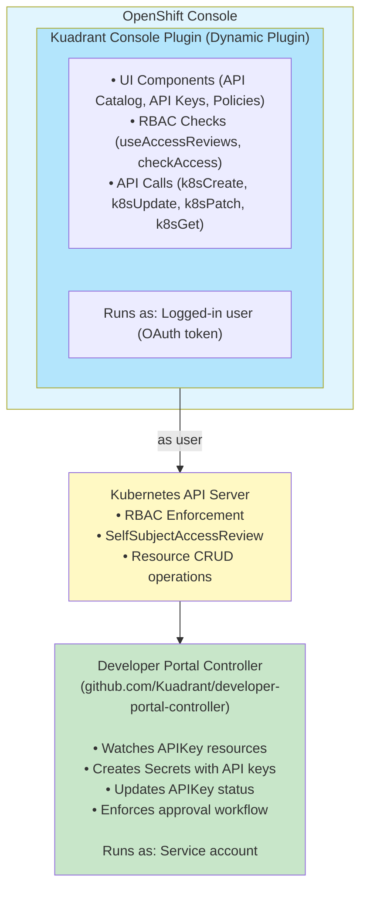

# Feature: API Management RBAC

## Summary

This design defines the RBAC system for developer portal capabilities in the Kuadrant Console Plugin. Unlike the Backstage plugin which uses ownership-based permissions (`backstage.io/owner` annotations), the console plugin uses **OpenShift's namespace-based RBAC** to control access to API products, API keys, kuadrant policies and Gateway API resources like HTTPRoutes and Gateways.

The design introduces three personas (API Consumer, API Owner, API Admin) with distinct permissions, leveraging Kubernetes native RBAC (Roles, ClusterRoles, RoleBindings, ClusterRoleBindings) to enforce access control. All operations are performed as the logged-in user via the OpenShift Console's authentication system.

## Goals

- Define RBAC roles for three core personas: API Consumer, API Owner, and API Admin
- Enable namespace-based isolation for API product management
- Provide clear permission boundaries using standard Kubernetes RBAC mechanisms
- Document deployment patterns for different organizational structures
- Create validation procedures to test RBAC implementation

## Non-Goals

- Custom authorization logic beyond Kubernetes RBAC
- Backend service accounts (all operations use logged-in user's permissions)
- Automated RBAC provisioning
- Developer Portal Controller RBAC (separate concern, controller has its own service account)

## Design

### Backwards Compatibility

**No breaking changes.** This is a new feature adding RBAC definitions for API Management resources that didn't previously have defined roles in the console plugin.

The new roles are additive and focus on API Management resources:

- `APIProduct` (`devportal.kuadrant.io/v1alpha1`) - API catalog entries
- `APIKey` (`devportal.kuadrant.io/v1alpha1`) - Consumer API access requests

All policies (PlanPolicy, AuthPolicy, RateLimitPolicy) are treated uniformly with read-only access for the new three personas.

### Architecture

#### Component Relationships



**Key architectural principles:**

- The console plugin uses OpenShift's namespace-based RBAC.
- All operations are performed as the logged-in user via the OpenShift Console's authentication system.
- The console plugin is UI for better user experience. UI elements hidden/disabled based on permission checks. But all the workflows must be allowed using kubectl clients, enabling so called gitops.
- Catalog visibility: All personas have cluster-wide read access to enable API discovery. Restrictions on catalog visibility not considered in this design.
- Console plugin has NO backend - all operations via OpenShift Console's Kubernetes API proxy
- User identity is preserved - all API calls made with logged-in user's OAuth token
- RBAC enforced by Kubernetes - not just UI hints
- Only owners should have permissions to approve/reject api requests (APIKey objects)
- Consumers must not have secret read permissions out of their namespaces
- Consumer should not create secrets. The controller should always create the secret.
- Consumers must have access only to their own api keys.

### API Changes

This design requires changes to existing CRDs and introduces a new CRD:

**New CRD**:

- **APIKeyApproval** (`devportal.kuadrant.io/v1alpha1`) - New resource for approval/rejection workflow

**Modified CRDs**:

- **APIKey** (`devportal.kuadrant.io/v1alpha1`) - Add `spec.apiProductRef.namespace`, change `status.phase` to `status.conditions`, remove several status fields

**Existing Resources** (no changes):

- **APIProduct**: Defined and managed by the [Developer Portal Controller](https://github.com/Kuadrant/developer-portal-controller)
- **PlanPolicy**, **AuthPolicy**, and **RateLimitPolicy**: Defined and managed by [Kuadrant Operator](https://github.com/Kuadrant/kuadrant-operator)
- **HTTPRoute**: Part of Kubernetes Gateway API

This design defines RBAC roles for console plugin users to interact with these resources.

### API Access Request Workflow

This section describes the high-level workflow for consumers to request and receive API access.

#### Workflow Steps

1. **Consumer browses catalog** - Consumer discovers published APIs across namespaces (cluster-wide read access to APIProducts)

2. **Consumer requests access** - Consumer creates APIKey resource in **their own namespace** with cross-namespace reference to APIProduct in owner's namespace

3. **APIKey enters Pending state** - The newly created APIKey has no conditions (`conditions: []`), indicating it's awaiting approval

4. **Owner discovers requests** - API Owner lists APIKeys cluster-wide, filtering by `spec.apiProductRef.namespace` matching their namespace

5. **Approval decision**:
   - **Automatic mode**: Controller automatically approves the request (no owner action needed)
   - **Manual mode**: API Owner creates APIKeyApproval resource in **their own namespace** with cross-namespace reference to consumer's APIKey

6. **Controller reconciles approval** - Controller reads APIKeyApproval (manual mode) or auto-approves (automatic mode) and updates APIKey `status.conditions` (Approved or Denied)

7. **On approval**: Controller creates Secret in **kuadrant namespace** (centralized secret storage for policy enforcement)

8. **Controller projects API key** - Controller exposes the API key value to the consumer via APIKey `status.apiKeyValue` in **consumer's namespace**

9. **Consumer retrieves API key** - Consumer accesses the projected API key value from their APIKey resource in their own namespace

10. **Consumer uses API** - Consumer authenticates API requests using the retrieved key

#### Key Architectural Decisions

**1. APIKey in Consumer's Namespace**

**Problem**: If APIKeys are in owner's namespace, Consumer A can see Consumer B's API keys (architectural principle: "Consumers must have access only to their own api keys").

**Solution**:

- Consumer creates APIKey in **their own namespace**
- APIKey references APIProduct via `spec.apiProductRef.namespace` (cross-namespace reference)
- Kubernetes RBAC naturally enforces consumer isolation via namespace boundaries
- API key value projected to `status.apiKeyValue` is only accessible in consumer's namespace

**2. APIKeyApproval CRD for Approval Workflow**

**Problem**: Kubernetes RBAC cannot enforce field-level permissions. If consumers update `status`, they could set approval conditions themselves.

**Solution**:

- Owner creates **APIKeyApproval** resource in their own namespace
- APIKeyApproval references APIKey via `spec.apiKeyRef.namespace` (cross-namespace reference)
- Owner has: `create apikeyapprovals` permission in their namespace
- Consumer does NOT have: `create apikeyapprovals` permission (no access to owner's namespace)
- Controller derives `status.conditions` (Approved/Denied) from APIKeyApproval existence
- **No validation webhook needed** - Clean RBAC separation via namespaces

**3. Centralized Secret Storage in Kuadrant Namespace**

**Problem**: Where should API key secrets be stored? Options include consumer's namespace, owner's namespace, or centralized storage.

**Solution**:

- Controller creates all API key secrets in **kuadrant namespace** (centralized storage)
- Secrets used by Kuadrant policies for authentication enforcement
- API key value projected to `status.apiKeyValue` in consumer's APIKey (consumer's namespace)
- **No namespace-specific RBAC needed** - Owners don't need secret permissions in their namespace
- **Simplified management** - Single location for all API key secrets (rotation, monitoring, cleanup)
- **Clean separation** - Secret storage is infrastructure concern, managed by controller

**4. Conditions Pattern (Following CertificateSigningRequest)**

- Replace `status.phase` with `status.conditions` array
- **Lifecycle states**:
  - `Pending`: The initial state. An APIKey is "Pending" if it has no conditions of type `Approved`, `Denied`, or `Failed`
  - `Approved`: Condition type set to "True" when approved (via APIKeyApproval or automatic mode)
  - `Denied`: Condition type set to "True" when rejected (via APIKeyApproval)
  - `Failed`: Condition type set to "True" when controller encounters an error
- Remove `status.reviewedBy`, `status.reviewedAt` - moved to APIKeyApproval spec

### API Management Resources

This section describes the key resources managed by the RBAC roles and their implications for permission design.

#### APIKey Resource (devportal.kuadrant.io/v1alpha1)

The `APIKey` resource is the core of the consumer access request workflow. Consumers create APIKeys to request access to published APIs.

```yaml
apiVersion: devportal.kuadrant.io/v1alpha1
kind: APIKey
metadata:
  name: mobile-app-payment-key
  namespace: consumer-team-mobile  # Consumer's own namespace
spec:
  # Cross-namespace reference to APIProduct
  apiProductRef:
    name: payment-api-v1
    namespace: payment-services  # Owner's namespace

  # Rate limiting plan tier
  planTier: "basic"  # e.g., "free", "basic", "premium", "enterprise"

  # Who requested this API key
  requestedBy:
    userId: "alice"
    email: "alice@mobile-team.example.com"

  # Use case justification
  useCase: "Mobile app integration for payment processing in our iOS/Android apps"

status:
  # Approval conditions (following CertificateSigningRequest pattern)
  # Lifecycle states:
  #   - Pending: No conditions (initial state after creation)
  #   - Approved: Approved condition with status "True"
  #   - Denied: Denied condition with status "True"
  #   - Failed: Failed condition with status "True"

  # Example: Approved state
  conditions:
    - type: Approved
      status: "True"
      reason: "ApprovedByOwner"
      message: "Approved for mobile team's payment integration project"
      lastTransitionTime: "2026-03-30T14:00:00Z"

    # OR for Denied state:
    # - type: Denied
    #   status: "True"
    #   reason: "RejectedByOwner"
    #   message: "API product not available for external use"
    #   lastTransitionTime: "2026-03-30T14:00:00Z"

    # OR for Pending state (initial):
    # conditions: []  # Empty array = Pending state

  # API key value projection (set by Developer Portal Controller)
  # Exposes the secret value to consumer without requiring secret read permissions
  # Secret is created in kuadrant namespace for centralized policy enforcement
  apiKeyValue: "sk_live_51MqPpGHl..."

  # Rate limits from selected plan
  limits:
    daily: 10000
    monthly: 300000
    custom:
      - limit: 100
        window: 1m

  # Authentication scheme
  authScheme:
    credentials:
      authorizationHeader:
        prefix: "Bearer"
    authenticationSpec:
      selector:
        matchLabels:
          kuadrant.io/apikey: mobile-app-payment-key

  # API hostname from HTTPRoute
  apiHostname: "api.payment.example.com"
```

**RBAC implications:**

- **Namespace placement**: APIKey created in **consumer's own namespace** (not owner's namespace)
- **Cross-namespace reference**: `spec.apiProductRef.namespace` references APIProduct in owner's namespace
- **Consumer isolation**: Each consumer only has permissions in their own namespace, preventing access to other consumers' API keys (architectural principle)
- **Approval workflow**:
  - API Owners create APIKeyApproval resource in their own namespace (manual mode only)
  - APIKeyApproval contains cross-namespace reference to consumer's APIKey
  - Consumers cannot approve/reject (architectural principle: consumers cannot create APIKeyApproval)
  - Controller reconciles approval and updates `status.conditions` based on APIKeyApproval or automatic mode
- **Conditions pattern** (following CertificateSigningRequest):
  - `Pending`: Initial state with no conditions (empty array)
  - `Approved` condition: Set to "True" when approved
  - `Denied` condition: Set to "True" when rejected
  - `Failed` condition: Set to "True" on controller errors
  - Conditions set by controller only, not by users
- **Secret projection**:
  - Controller creates Secret in **kuadrant namespace** for centralized policy enforcement
  - Controller projects secret value into `status.apiKeyValue` in **consumer's namespace**
  - **Consumer retrieves API key from status field, not from Secret**
  - **Consumer does NOT need `get secrets` permission** (architectural principle)

#### APIProduct Resource (devportal.kuadrant.io/v1alpha1)

API Owners publish APIProducts to make their APIs discoverable in the developer portal catalog.

```yaml
apiVersion: devportal.kuadrant.io/v1alpha1
kind: APIProduct
metadata:
  name: payment-api-v1
  namespace: payment-services
spec:
  displayName: "Payment API v1"
  description: "Process payments and manage transactions"
  version: "v1"

  # Approval mode (determines if manual approval needed)
  approvalMode: manual  # "manual" | "automatic"

  # Visibility in catalog
  publishStatus: Published  # "Draft" | "Published"

  tags:
    - payments
    - fintech

  # Reference to HTTPRoute
  targetRef:
    group: gateway.networking.k8s.io
    kind: HTTPRoute
    name: payment-api-route

  documentation:
    url: "https://docs.example.com/payment-api"
```

**RBAC implications:**

- **Namespace ownership**: API Owners can only create/update/delete APIProducts in their assigned namespaces
- **Catalog visibility**: All personas have cluster-wide read access to enable API discovery
- **Approval workflow**:
  - `approvalMode: automatic` → APIKeys approved immediately by Developer Portal Controller (no owner intervention)
  - `approvalMode: manual` → Owner creates APIKeyApproval resource to approve/reject consumer requests
- **Draft products**: `publishStatus: Draft` can be used to hide products from catalog while in development (UI can filter by this field)
- **HTTPRoute reference**: `spec.targetRef` must reference an HTTPRoute in the same namespace (namespace-local reference)
- **Owner permissions**: Requires `create apiproducts` permission in namespace, plus `get httproutes` to select valid routes

#### APIKeyApproval Resource (devportal.kuadrant.io/v1alpha1)

API Owners create APIKeyApproval resources to approve or reject consumer API access requests in **manual approval mode**.

```yaml
apiVersion: devportal.kuadrant.io/v1alpha1
kind: APIKeyApproval
metadata:
  name: mobile-app-payment-key-approval
  namespace: payment-services  # Owner's namespace (same as APIProduct)
spec:
  # Cross-namespace reference to the APIKey being approved/rejected
  apiKeyRef:
    name: mobile-app-payment-key
    namespace: consumer-team-mobile  # Consumer's namespace

  # Approval decision
  approved: true  # true = Approved, false = Rejected/Denied

  # Who made the decision
  reviewedBy: "bob@payment-team.com"

  # When the decision was made
  reviewedAt: "2026-03-30T14:00:00Z"

  # Reason for decision
  reason: "ApprovedByOwner"

  # Review notes/message
  message: "Approved for mobile team's payment integration project. Contact us if you need higher limits."
```

**RBAC implications:**

- **Owner-only resource**: Only API Owners can create/update/delete APIKeyApproval resources
- **Namespace placement**: APIKeyApproval created in **owner's namespace** (same as APIProduct)
- **Cross-namespace reference**: `spec.apiKeyRef.namespace` references APIKey in consumer's namespace
- **Review metadata**: All approval/rejection metadata stored in APIKeyApproval (reviewedBy, reviewedAt, reason, message)
- **Controller reconciliation**:
  - Controller watches APIKeyApproval resources cluster-wide
  - If `spec.approved = true`: Sets `Approved` condition to "True" in APIKey status and creates Secret
  - If `spec.approved = false`: Sets `Denied` condition to "True" in APIKey status
  - If no APIKeyApproval exists: No approval/denial conditions set (pending state)
  - Copies `reviewedBy`, `reason`, `message` into condition fields
- **Clean RBAC separation**:
  - Consumers have `create/update/delete apikeys` permissions in their own namespace
  - Consumers do NOT have `create apikeyapprovals` permissions (no access to owner's namespace)
  - **No validation webhook needed** - Kubernetes RBAC enforces separation via namespaces
- **Automatic approval mode**: APIKeyApproval resource not needed when `APIProduct.spec.approvalMode = automatic`

#### Policy and Route Resources

In addition to APIProduct and APIKey, API consumers need read-only access to policies and routes to understand API requirements, endpoints, and rate limits.

**Policies** (all read-only for consumers and owners)

1. **PlanPolicy** (`extensions.kuadrant.io/v1alpha1`)
   - Platform-managed rate limiting plan templates
   - Defines tiers (e.g., free, basic, premium, enterprise)

2. **AuthPolicy** (`kuadrant.io/v1`)
   - Authentication and authorization requirements
   - Shows what credentials are needed (API key, OAuth, JWT, etc.)
   - Applied to HTTPRoutes or Gateways

3. **RateLimitPolicy** (`kuadrant.io/v1`)
   - Route-specific rate limiting configurations
   - May differ from PlanPolicy defaults
   - Shows actual limits applied to specific APIs

**Routes**

1. **HTTPRoute** (`gateway.networking.k8s.io/v1`)
   - API endpoints, paths, and HTTP methods
   - Hostname and path prefixes
   - Backend service references
   - Referenced by APIProduct via `spec.targetRef`

**RBAC implications:**

- All policies and routes: consumers and owners have cluster-wide read-only access
- Owners may have write access to these resources in their own namespaces (separate policy management roles)
- Admins have full access to all policies and routes

### RBAC Enforcement

#### Console Plugin Permission Checks

The OpenShift Console plugin enforces RBAC using `SelfSubjectAccessReview` API calls. All operations are performed as the logged-in user via OAuth token - there is no backend service account.

**Enforcement mechanism:**

1. **Progressive disclosure**: UI checks permissions before rendering action buttons/menu items
2. **Backend enforcement**: Kubernetes API server enforces RBAC on all resource operations
3. **User identity preservation**: All API calls use the logged-in user's credentials

**Key principle**: RBAC is enforced by Kubernetes, not just UI hints. Even if UI is bypassed (e.g., via kubectl), Kubernetes API server will deny unauthorized operations.

#### Developer Portal Controller

The Developer Portal Controller (separate repository) handles:

1. Watching `APIKey` resources
2. Creating `Secret` resources with generated API key values
3. Updating `APIKey` status with secret reference
4. Enforcing approval workflow based on `APIProduct.spec.approvalMode`

**Controller RBAC** (not part of this design, but documented for completeness):

```yaml
# Controller service account needs cluster-wide permissions:
- apiGroups: ["devportal.kuadrant.io"]
  resources: ["apikeys"]
  verbs: ["get", "list", "watch"]
- apiGroups: ["devportal.kuadrant.io"]
  resources: ["apikeys/status"]
  verbs: ["update", "patch"]
- apiGroups: ["devportal.kuadrant.io"]
  resources: ["apikeyapprovals"]
  verbs: ["get", "list", "watch"]
- apiGroups: ["devportal.kuadrant.io"]
  resources: ["apiproducts"]
  verbs: ["get", "list", "watch"]
- apiGroups: [""]
  resources: ["secrets"]
  verbs: ["create", "update", "delete", "get", "list"]
  # Secrets created in kuadrant namespace only (centralized storage)
```

### Security Considerations

#### 1. Namespace Isolation

**Consumer isolation via namespaces:**

- Consumer A creates APIKeys in `consumer-team-mobile` namespace
- Consumer B creates APIKeys in `consumer-team-backend` namespace
- Each consumer only has permissions in their own namespace
- **Security guarantee**: Kubernetes RBAC enforces that Consumer A cannot access Consumer B's APIKeys
- **API key value protection**: `status.apiKeyValue` is only readable in consumer's own namespace
- **No cross-consumer leakage**: Architectural principle "Consumers must have access only to their own api keys" enforced by namespace boundaries

#### 2. Secret Projection

**API key delivery via status:**

- Controller creates Secret in **kuadrant namespace** (centralized storage for policy enforcement)
- Controller projects secret value into `status.apiKeyValue` in **consumer's namespace**
- Consumer retrieves API key from APIKey status in their own namespace, not from Secret resource
- **Security benefit**: Consumer never needs `get secrets` permission in kuadrant namespace
- Centralized secret management in kuadrant namespace simplifies policy enforcement and secret rotation
- Owners do not need secret read permissions (secrets managed centrally by controller)
- **No one-time viewing complexity**: Removed `canReadSecret` flag - consumers can view their API key anytime from their own APIKey resource. Can be implemented in the UI via annotations, but not real enforcement.

**Secret rotation:**

- No automatic secret rotation mechanism
- Consumer must delete old APIKey and create new one
- Owner can deny/revoke by deleting APIKeyApproval (controller removes `Approved` condition and deletes Secret from kuadrant namespace)

#### 3. Approval Enforcement

**Automatic approval mode:**

- `APIProduct.spec.approvalMode: automatic` grants immediate access
- **Risk**: Owner accidentally sets automatic mode for sensitive API
- **Mitigation**: Document approval modes clearly, UI should warn when switching to automatic

**Approval separation via APIKeyApproval CRD:**

- **Architecture**: Owner creates APIKeyApproval resource in **their own namespace** to approve/reject requests
- **Cross-namespace reference**: APIKeyApproval references APIKey in consumer's namespace
- **RBAC enforcement**: Consumers cannot create APIKeyApproval resources (no permission in owner's namespace)
- **Status as output**: `status.conditions` reconciled by controller, not set directly by users
- **Conditions pattern**: Follows CertificateSigningRequest pattern (Approved/Denied conditions)
- **No validation webhook needed**: Clean RBAC separation via namespaces and separate resource type
- **Controller responsibility**:
  - Watches APIKeyApproval resources cluster-wide
  - Reconciles `status.conditions` (Approved/Denied) based on APIKeyApproval existence and `approved` field
  - Creates Secret in kuadrant namespace only when approved (centralized storage)
  - Projects secret value to consumer's APIKey status

#### 4. Cross-namespace References

**APIKey cross-namespace references:**

- Consumers create APIKeys in **their own namespace** (not owner's namespace)
- APIKey contains `spec.apiProductRef.namespace` referencing owner's APIProduct
- **No consumer permissions needed in owner's namespace** - cross-namespace references are read-only
- Consumers retrieve API key value via `status.apiKeyValue` projection in their own namespace
- **Security**: Consumers do NOT have `get secrets` permission in kuadrant namespace (architectural principle)
- Secrets stored centrally in kuadrant namespace for policy enforcement

**APIKeyApproval cross-namespace references:**

- Owners create APIKeyApproval in **their own namespace**
- APIKeyApproval contains `spec.apiKeyRef.namespace` referencing consumer's APIKey
- **Owners have cluster-wide read on APIKeys** to discover requests for their APIs
- Owners filter by `spec.apiProductRef.namespace` matching their namespace

#### 5. RBAC Privilege Escalation

**Owner cannot become admin:**

- Owners have namespace-scoped permissions only
- Cannot create PlanPolicies (platform-managed resource - even admins cannot create)
- Cannot modify products in other namespaces

**Consumer cannot become owner:**

- Consumers have limited write operations (create/update/delete APIKeys only)
- Cannot create or modify APIProducts
- Cannot approve APIKeys (architectural principle: only owners can create APIKeyApproval resources)
- Cannot create APIKeyApproval resources (no RBAC permission granted to consumers)

## Permission Matrix

### Core API Management Resources

| Resource | Action | Consumer (own NS) | Owner (own NS) | Owner (other NS) | Admin |
|----------|--------|:--------:|:--------------:|:----------------:|:-----:|
| **APIProduct** | get/list | ✅ Cluster-wide | ✅ Cluster-wide | ✅ Cluster-wide | ✅ Cluster-wide |
| APIProduct | create | ❌ | ✅ | ❌ | ✅ |
| APIProduct | update | ❌ | ✅ | ❌ | ✅ |
| APIProduct | delete | ❌ | ✅ | ❌ | ✅ |
| **APIKey** | get/list | ✅ | ✅ Cluster-wide | ✅ Cluster-wide | ✅ Cluster-wide |
| APIKey | create | ✅ | ❌ | ❌ | ✅ |
| APIKey | update | ✅ | ❌ | ❌ | ✅ |
| APIKey | delete | ✅ | ❌ | ❌ | ✅ |
| **APIKeyApproval** | get/list | ❌ | ✅ | ❌ | ✅ Cluster-wide |
| APIKeyApproval | create | ❌ | ✅ | ❌ | ✅ |
| APIKeyApproval | update | ❌ | ✅ | ❌ | ✅ |
| APIKeyApproval | delete | ❌ | ✅ | ❌ | ✅ |

### Supporting Policies and Routes (Read-Only)

| Resource | Action | Consumer | Owner | Admin |
|----------|--------|:--------:|:-----:|:-----:|
| PlanPolicy | get/list | ✅ Cluster-wide | ✅ Cluster-wide | ✅ Cluster-wide |
| PlanPolicy | create/update/delete | ❌ | ❌ | ❌ |
| AuthPolicy | get/list | ✅ Cluster-wide | ✅ Cluster-wide | ✅ Cluster-wide |
| RateLimitPolicy | get/list | ✅ Cluster-wide | ✅ Cluster-wide | ✅ Cluster-wide |
| HTTPRoute | get/list | ✅ Cluster-wide | ✅ Cluster-wide | ✅ Cluster-wide |
| Gateway | get/list | ❌ | ✅ Cluster-wide | ✅ Cluster-wide |

**Notes**:

- **Consumer APIKey access**: Always **namespace-scoped** (never cluster-wide). Consumers can only access APIKeys in namespaces where they have Role bindings
- **Consumer catalog access**: Cluster-wide read access to APIProducts, policies, and routes for discovery
- **APIKey namespace**: Consumers create APIKeys in designated namespace(s) - shared (Pattern 1) or per-team (Pattern 2)
- **APIKey filtering**: Owners use cluster-wide read to discover requests by filtering `spec.apiProductRef.namespace`
- **APIKeyApproval namespace**: Owners create APIKeyApproval in their own namespace with cross-namespace reference to consumer's APIKey
- **Secret access**: NO personas (consumers, owners, admins) need secret read permissions for API Management. API key values delivered via `status.apiKeyValue` projection. Secrets stored centrally in kuadrant namespace and managed exclusively by Developer Portal Controller.
- **PlanPolicies**: Read-only for all API Management personas (consumers, owners, admins). PlanPolicies are platform-managed resources, not controlled by API Management roles.
- **Policies/Routes**: AuthPolicy, RateLimitPolicy, HTTPRoute, Gateway are read-only for API Management roles. Owners may have write access via separate non-API-Management roles if needed.
- **Cluster-wide**: Permission applies across all namespaces (for discovery/catalog browsing only, not APIKey operations)

## RBAC Manifests

This section contains the complete Kubernetes RBAC manifests for API Management roles.

### API Consumer ClusterRole

```yaml
---
# API Consumer ClusterRole
# Allows developers to create and manage API access requests and browse the API catalog
# Includes namespace-scoped APIKey management and cluster-wide read access for catalog browsing
#
# Usage:
#   kubectl apply -f api-consumer-role.yaml
#
#   Bind to users or groups in their namespace using RoleBinding:
#   kubectl create rolebinding api-consumer-binding \
#     --clusterrole=api-consumer \
#     --user=<username> \
#     -n <consumer-namespace>
#
# Note: ClusterRole + RoleBinding = namespace-scoped write permissions
#       The consumer can only manage APIKeys in namespaces where they have a RoleBinding
#       Cluster-wide read permissions allow consumers to discover all published APIs
#
apiVersion: rbac.authorization.k8s.io/v1
kind: ClusterRole
metadata:
  name: api-consumer
rules:
  # Create and manage API keys in consumer's own namespace (namespace-scoped via RoleBinding)
  - apiGroups: ["devportal.kuadrant.io"]
    resources: ["apikeys"]
    verbs: ["get", "list", "create", "update", "delete"]

  # Read APIKey status to retrieve projected API key value
  # NOTE: Consumers do NOT update status - controller manages all status fields
  - apiGroups: ["devportal.kuadrant.io"]
    resources: ["apikeys/status"]
    verbs: ["get"]

  # Browse all API products for discovery (cluster-wide)
  - apiGroups: ["devportal.kuadrant.io"]
    resources: ["apiproducts"]
    verbs: ["get", "list"]

  # View policies cluster-wide (read-only, to understand API requirements)
  - apiGroups: ["extensions.kuadrant.io"]
    resources: ["planpolicies"]
    verbs: ["get", "list"]
  - apiGroups: ["kuadrant.io"]
    resources: ["authpolicies", "ratelimitpolicies"]
    verbs: ["get", "list"]

  # View HTTPRoutes cluster-wide (read-only, to understand API endpoints)
  - apiGroups: ["gateway.networking.k8s.io"]
    resources: ["httproutes"]
    verbs: ["get", "list"]

  # NOTE: Consumers do NOT have secret read permissions (architectural principle)
  # API key values are delivered via status.apiKeyValue projection by the controller

  # NOTE: Consumers do NOT have apikeyapprovals permissions (architectural principle)
  # Only API owners can approve/reject requests
```

### API Owner ClusterRole

```yaml
---
# API Owner ClusterRole
# Allows teams to publish and manage APIs in their namespace
# Includes cluster-wide read access for catalog browsing and request discovery
#
# Usage:
#   kubectl apply -f api-owner-role.yaml
#
#   Bind to team users or groups in their namespace using RoleBinding:
#   kubectl create rolebinding api-owner-binding \
#     --clusterrole=api-owner \
#     --group=team-payment-services \
#     -n payment-services
#
# Note: ClusterRole + RoleBinding = namespace-scoped write permissions
#       The owner can only manage APIProducts and APIKeyApprovals in namespaces where they have a RoleBinding
#       Cluster-wide read permissions allow owners to discover all APIs and view all APIKey requests
#
apiVersion: rbac.authorization.k8s.io/v1
kind: ClusterRole
metadata:
  name: api-owner
rules:
  # Manage API products (namespace-scoped via RoleBinding)
  - apiGroups: ["devportal.kuadrant.io"]
    resources: ["apiproducts"]
    verbs: ["get", "list", "create", "update", "patch", "delete"]

  # Approve/reject API key requests via APIKeyApproval resource (namespace-scoped via RoleBinding)
  - apiGroups: ["devportal.kuadrant.io"]
    resources: ["apikeyapprovals"]
    verbs: ["get", "list", "create", "update", "patch", "delete"]

  # View API key requests cluster-wide (to discover requests for own APIs)
  # Owners filter by spec.apiProductRef.namespace matching their namespace
  - apiGroups: ["devportal.kuadrant.io"]
    resources: ["apikeys"]
    verbs: ["get", "list"]

  # View rate limiting plans cluster-wide (reference when creating products)
  - apiGroups: ["extensions.kuadrant.io"]
    resources: ["planpolicies"]
    verbs: ["get", "list"]

  # View policies cluster-wide (read-only, to understand API requirements)
  - apiGroups: ["kuadrant.io"]
    resources: ["authpolicies", "ratelimitpolicies"]
    verbs: ["get", "list"]

  # View HTTPRoutes cluster-wide (for discovery and referencing in APIProducts)
  - apiGroups: ["gateway.networking.k8s.io"]
    resources: ["httproutes"]
    verbs: ["get", "list"]

  # View Gateways cluster-wide (for context)
  - apiGroups: ["gateway.networking.k8s.io"]
    resources: ["gateways"]
    verbs: ["get", "list"]

  # NOTE: Secrets are managed by Developer Portal Controller in kuadrant namespace
  # API key values are delivered to consumers via status.apiKeyValue projection
  # Owners do not need secret permissions for API Management
```

### API Admin ClusterRole

```yaml
---
# API Admin ClusterRole
# Grants full access to API management resources across all namespaces
# Used by platform team members who manage the API catalog and troubleshoot issues
#
# Usage:
#   kubectl apply -f api-admin-clusterrole.yaml
#
#   Bind to admin users:
#   kubectl create clusterrolebinding api-admin-alice \
#     --clusterrole=api-admin \
#     --user=alice
#
#   Bind to admin group:
#   kubectl create clusterrolebinding api-admin-platform-team \
#     --clusterrole=api-admin \
#     --group=platform-team
#
apiVersion: rbac.authorization.k8s.io/v1
kind: ClusterRole
metadata:
  name: api-admin
rules:
  # Full access to API products across all namespaces
  - apiGroups: ["devportal.kuadrant.io"]
    resources: ["apiproducts"]
    verbs: ["get", "list", "create", "update", "patch", "delete", "watch"]

  # Full access to API keys across all namespaces
  - apiGroups: ["devportal.kuadrant.io"]
    resources: ["apikeys"]
    verbs: ["get", "list", "create", "update", "delete", "watch"]

  # Full access to API key approvals across all namespaces
  # Allows admins to approve/reject on behalf of owners
  - apiGroups: ["devportal.kuadrant.io"]
    resources: ["apikeyapprovals"]
    verbs: ["get", "list", "create", "update", "patch", "delete", "watch"]

  # NOTE: Secrets are managed by Developer Portal Controller in kuadrant namespace
  # API key values are delivered to consumers via status.apiKeyValue projection
  # Admins do not need secret permissions for API Management

  # View rate limiting plans (read-only - PlanPolicies are platform-managed)
  - apiGroups: ["extensions.kuadrant.io"]
    resources: ["planpolicies"]
    verbs: ["get", "list", "watch"]

  # View all route-level policies for troubleshooting
  - apiGroups: ["kuadrant.io"]
    resources: ["authpolicies", "ratelimitpolicies"]
    verbs: ["get", "list", "watch"]

  # View HTTPRoutes and Gateways
  - apiGroups: ["gateway.networking.k8s.io"]
    resources: ["httproutes", "gateways"]
    verbs: ["get", "list", "watch"]

  # Read ConfigMaps for topology view
  - apiGroups: [""]
    resources: ["configmaps"]
    verbs: ["get", "list"]
```

## Implementation Plan

This design has been implemented with the following deliverables:

### ✅ Completed: RBAC Role Definitions

**Deliverables:**

- ✅ RBAC ClusterRole manifests (see "RBAC Manifests" section above)
  - `api-consumer` - Consumer ClusterRole (includes namespace-scoped APIKey management and cluster-wide catalog browsing)
  - `api-owner` - Owner ClusterRole (includes namespace-scoped API management and cluster-wide catalog browsing)
  - `api-admin` - Admin ClusterRole
- ✅ `docs/designs/2026-03-26-api-management-rbac-design.md` - This design document (includes all RBAC manifests and validation procedures)

### 🚧 Required Implementation

**APIKeyApproval CRD** (github.com/Kuadrant/developer-portal-controller):

- New CRD to represent approval/rejection decisions
- Owner creates APIKeyApproval in their namespace with cross-namespace reference to consumer's APIKey
- Contains review metadata: reviewedBy, reviewedAt, reason, message
- Provides clean RBAC separation (no validation webhook needed)

**APIKey CRD Updates** (github.com/Kuadrant/developer-portal-controller):

- Add `spec.apiProductRef.namespace` for cross-namespace reference
- Replace `status.phase` with `status.conditions` (following CertificateSigningRequest pattern)
  - `Pending`: Initial state (no conditions)
  - `Approved`: Approved condition type
  - `Denied`: Denied condition type
  - `Failed`: Failed condition type (controller errors)
- Remove `status.secretRef`, `status.canReadSecret`, `status.reviewedBy`, `status.reviewedAt`
- Keep `status.apiKeyValue` for secret projection

**Developer Portal Controller** (github.com/Kuadrant/developer-portal-controller):

- Watch APIKey resources cluster-wide (consumers create in their own namespaces)
- Watch APIKeyApproval resources cluster-wide (owners create in their own namespaces)
- Reconcile `status.conditions` (Approved/Denied) based on:
  - APIKeyApproval existence and `approved` field (manual mode)
  - Automatic approval (automatic mode)
- Create Secret in **kuadrant namespace** (centralized storage) when approved
- Project API key value into `status.apiKeyValue` in **consumer's namespace** when approved
- Handle cross-namespace references between APIKey, APIKeyApproval, and APIProduct

### Future Work (Out of Scope for RBAC Design)

**Console Plugin Implementation** (separate work):

- UI reads API key from `status.apiKeyValue` instead of Secret
- Progressive disclosure via `SelfSubjectAccessReview`
- Client-side filtering for APIKey lists by `requestedBy.userId`

**Kuadrant Operator Integration** (future enhancement):

- Include RBAC ClusterRoles in operator deployment
- Auto-create roles during Kuadrant installation
- Namespace templates for team onboarding

## Testing Strategy

RBAC testing focuses on verifying that Kubernetes enforces the defined permissions correctly.

### kubectl Impersonation Tests

Use `kubectl --as=<user>` to test permissions without creating real users:

```bash
# Test consumer permissions (assuming consumer-a has access to 'api-consumer-a' namespace)
kubectl auth can-i list apiproducts --as=test-api-consumer-a --all-namespaces  # Should succeed (cluster-wide catalog)
kubectl auth can-i create apikeys --as=test-api-consumer-a -n api-consumer-a  # Should succeed (own namespace)
kubectl auth can-i create apikeys --as=test-api-consumer-a -n api-consumer-b  # Should fail (no binding, isolation)
kubectl auth can-i list apikeys --as=test-api-consumer-a --all-namespaces  # Should fail (namespace-scoped only)
kubectl auth can-i create apiproducts --as=test-api-consumer-a -n api-consumer-a  # Should fail

# Test owner permissions
kubectl auth can-i list apikeys --as=test-api-owner-team-a --all-namespaces  # Should succeed (cluster-wide discovery)
kubectl auth can-i create apiproducts --as=test-api-owner-team-a -n api-team-a  # Should succeed (own namespace)
kubectl auth can-i create apiproducts --as=test-api-owner-team-a -n api-team-b  # Should fail
kubectl auth can-i create apikeyapprovals --as=test-api-owner-team-a -n api-team-a  # Should succeed

# Test admin permissions
kubectl auth can-i list planpolicies --as=test-api-admin --all-namespaces  # Should succeed (read-only)
kubectl auth can-i delete apiproducts --as=test-api-admin -n api-team-a  # Should succeed
kubectl auth can-i list apikeys --as=test-api-admin --all-namespaces  # Should succeed
```

### Manual Validation

Comprehensive validation procedures:

1. **Consumer scenario**: Browse catalog, create APIKey, verify denials
2. **Owner scenario**: Create APIProduct in own namespace, approve APIKey, verify cross-namespace denials
3. **Admin scenario**: Manage APIProducts, APIKeys, and APIKeyApprovals across all namespaces
4. **Negative tests**: Verify permission denials work as expected

See the "Validation Checklist" section below for detailed test scenarios.

### Validation Checklist

#### Consumer Testing

**Positive Permissions** (should succeed):

- [ ] Can list all APIProducts cluster-wide (`kubectl get apiproducts --all-namespaces`)
- [ ] Can get specific APIProduct details
- [ ] Can view PlanPolicies, AuthPolicies, RateLimitPolicies, HTTPRoutes (read-only, cluster-wide)
- [ ] Can create APIKey in own namespace with cross-namespace reference to APIProduct
- [ ] Can update own APIKey in own namespace
- [ ] Can delete own APIKey in own namespace
- [ ] Can read APIKey status to retrieve `apiKeyValue` (projected secret)

**Negative Permissions** (should fail):

- [ ] Cannot create APIProducts in any namespace
- [ ] Cannot create APIKeys in other consumer namespaces
- [ ] Cannot read APIKeys in other consumer namespaces (isolation test)
- [ ] Cannot create APIKeyApproval resources (approval denied)
- [ ] Cannot read Secrets in kuadrant namespace (no secret access)
- [ ] Cannot update APIKey status (conditions are controller-managed)

#### Owner Testing

**Positive Permissions** (should succeed):

- [ ] Can list all APIProducts cluster-wide
- [ ] Can list all APIKeys cluster-wide (to discover requests)
- [ ] Can filter APIKeys by `spec.apiProductRef.namespace` matching own namespace
- [ ] Can create APIProduct in own namespace
- [ ] Can update/delete APIProduct in own namespace
- [ ] Can create APIKeyApproval in own namespace with cross-namespace reference to consumer's APIKey
- [ ] Can update/delete APIKeyApproval in own namespace
- [ ] Can view HTTPRoutes and Gateways cluster-wide

**Negative Permissions** (should fail):

- [ ] Cannot create APIProduct in other team namespaces
- [ ] Cannot delete APIProduct in other team namespaces
- [ ] Cannot create APIKeyApproval in other team namespaces
- [ ] Cannot create APIKeys (consumers create in their own namespace)
- [ ] Cannot update APIKey status (controller-managed)
- [ ] Cannot read Secrets in kuadrant namespace (no secret access)

#### Admin Testing

**Positive Permissions** (should succeed):

- [ ] Can list APIProducts cluster-wide
- [ ] Can list APIKeys cluster-wide
- [ ] Can list APIKeyApprovals cluster-wide
- [ ] Can create APIProduct in any namespace
- [ ] Can update/delete APIProduct in any namespace
- [ ] Can create APIKeyApproval in any namespace (on behalf of owners)
- [ ] Can delete APIKeyApprovals in any namespace
- [ ] Can view PlanPolicies cluster-wide (read-only - platform-managed)
- [ ] Can view all Kuadrant policies (AuthPolicy, RateLimitPolicy, etc.)

#### Cross-Namespace Workflow Test

**End-to-end scenario**:

1. [ ] Consumer creates APIKey in `consumer-team-mobile` namespace
2. [ ] APIKey references APIProduct in `api-team-payments` namespace (cross-namespace ref)
3. [ ] Owner in `api-team-payments` lists APIKeys cluster-wide
4. [ ] Owner filters APIKeys: `kubectl get apikeys -A -o json | jq '.items[] | select(.spec.apiProductRef.namespace=="api-team-payments")'`
5. [ ] Owner creates APIKeyApproval in `api-team-payments` namespace
6. [ ] APIKeyApproval references APIKey in `consumer-team-mobile` namespace (cross-namespace ref)
7. [ ] Controller reconciles: Sets `Approved` condition in APIKey status
8. [ ] Controller creates Secret in `kuadrant` namespace (centralized storage)
9. [ ] Controller projects secret value to APIKey `status.apiKeyValue` in `consumer-team-mobile` namespace
10. [ ] Consumer reads `status.apiKeyValue` from their APIKey in own namespace
11. [ ] Consumer CANNOT read Secret in `kuadrant` namespace (isolation verified)
12. [ ] Owner CANNOT read Secret in `kuadrant` namespace (secrets managed by controller only)
13. [ ] Admin CANNOT read Secret in `kuadrant` namespace (no secret permissions for API Management)

### Test Personas

Test users for kubectl impersonation testing:

- `test-api-consumer-a` - Consumer with access to `api-consumer-a` namespace (for isolation testing)
- `test-api-consumer-b` - Consumer with access to `api-consumer-b` namespace (for isolation testing)
- `test-api-owner-team-a` - Owner with access to `api-team-a` namespace
- `test-api-owner-team-b` - Owner with access to `api-team-b` namespace
- `test-api-admin` - Admin with cluster-wide access

**Note**: Two consumer personas enable testing namespace isolation (Pattern 2). Consumer A cannot access Consumer B's APIKeys and vice versa.

## Deployment Patterns

This section describes common patterns for deploying RBAC roles in different organizational structures.

### Pattern 1: Single Shared Consumer Namespace (Simple)

All consumers share one namespace and use catalog cluster-wide.

```bash
# Create shared consumer namespace
kubectl create namespace api-consumers

# Apply consumer ClusterRoles (once, cluster-wide)
# Apply Consumer ClusterRole (see "RBAC Manifests" section above for complete YAML)

# Bind all consumers to the shared namespace (ClusterRole + RoleBinding = namespace-scoped write permissions)
# Cluster-wide read permissions already included in api-consumer ClusterRole
kubectl create rolebinding api-consumer-binding \
  --clusterrole=api-consumer \
  --group=api-consumers \
  -n api-consumers
```

**How it works**:

- All consumers create APIKeys in `api-consumers` namespace
- Consumers can see all APIKeys in the shared namespace
- UI filters by `spec.requestedBy.userId` to show only user's own keys
- Consumers browse catalog cluster-wide to discover APIs

**Benefits**:

- ✅ Simple deployment (one namespace, two bindings)
- ✅ Easy to manage and troubleshoot
- ✅ Good for small teams or trusted environments

**Trade-offs**:

- ⚠️ Consumers can see each other's APIKey metadata in shared namespace
- ⚠️ API key values still protected (only in status, consumers see their own)
- ⚠️ No RBAC enforcement between consumers (UI filtering only)

**Use when**: Simple deployment, trusted consumer community, low security requirements

### Pattern 2: Namespace-Scoped Consumer Permissions (Strict Isolation)

Each consumer team gets namespace-scoped RBAC permissions for strict isolation.

```bash
# Create namespace for each consumer team
kubectl create namespace consumer-team-mobile
kubectl create namespace consumer-team-backend

# Apply consumer ClusterRoles (once, cluster-wide)
# Apply Consumer ClusterRole (see "RBAC Manifests" section above for complete YAML)

# Bind to teams/users (ClusterRole + RoleBinding = namespace-scoped write permissions)
# Cluster-wide read permissions already included in api-consumer ClusterRole
kubectl create rolebinding api-consumer-binding \
  --clusterrole=api-consumer \
  --group=mobile-app-developers \
  -n consumer-team-mobile
```

**Benefits**:

- ✅ **RBAC-enforced isolation** (architectural principle: "Consumers must have access only to their own api keys")
- ✅ Team mobile can ONLY create/read APIKeys in consumer-team-mobile
- ✅ Team backend can ONLY create/read APIKeys in consumer-team-backend
- ✅ Kubernetes enforces boundaries (not trust-based)

**Trade-offs**:

- ⚠️ More complex deployment (RoleBinding per team per namespace)
- ⚠️ Less flexible (consumers locked to specific namespaces)

**Use when**: Multiple consumer teams require strict, RBAC-enforced isolation

### Pattern 3: API Owner Namespace Per Team

Each API owner team gets their own namespace for publishing APIs and managing approvals.

```bash
# Create namespace for each API owner team
kubectl create namespace api-team-payments
kubectl create namespace api-team-shipping

# Apply Owner ClusterRole (see "RBAC Manifests" section above for complete YAML)

# Bind to teams (ClusterRole + RoleBinding = namespace-scoped write, cluster-wide read)
kubectl create rolebinding api-owner-binding \
  --clusterrole=api-owner \
  --group=team-payments \
  -n api-team-payments

# Note: api-owner includes cluster-wide read permissions for catalog browsing and request discovery
# No separate ClusterRoleBinding needed
```

**Benefits**:

- ✅ Teams manage APIs independently in their namespaces
- ✅ Secrets stored centrally in kuadrant namespace (simplified management)
- ✅ Owners can discover requests across all consumer namespaces

**Use when**: Multiple teams independently manage their own APIs

### Pattern 4: Platform Admin

Platform administrators manage API infrastructure and troubleshoot across all namespaces.

```bash
# Apply admin ClusterRole (cluster-wide)
# Apply Admin ClusterRole (see "RBAC Manifests" section above for complete YAML)

# Bind to platform team or admins
kubectl create clusterrolebinding api-admin-platform-team \
  --clusterrole=api-admin \
  --group=platform-team

# Or bind to individual admin users
kubectl create clusterrolebinding api-admin-alice \
  --clusterrole=api-admin \
  --user=alice@example.com
```

**Benefits**:

- ✅ Full visibility and control across all namespaces
- ✅ Can troubleshoot and override decisions
- ✅ Can view all PlanPolicies (read-only - PlanPolicies are platform-managed)

**Use when**: Central platform team manages API infrastructure

### Combined Example: Complete Setup

```bash
# 1. Create namespaces
kubectl create namespace consumer-team-mobile
kubectl create namespace api-team-payments

# 2. Deploy RBAC ClusterRoles (once, cluster-wide)
# Apply Consumer ClusterRole (see "RBAC Manifests" section above for complete YAML)
# Apply Owner ClusterRole (see "RBAC Manifests" section above for complete YAML)
# Apply Admin ClusterRole (see "RBAC Manifests" section above for complete YAML)

# 3. Bind consumer team (ClusterRole + RoleBinding = namespace-scoped write permissions)
# Cluster-wide read permissions already included in api-consumer ClusterRole
kubectl create rolebinding api-consumer-binding \
  --clusterrole=api-consumer \
  --group=mobile-app-developers \
  -n consumer-team-mobile

# 4. Bind owner team (ClusterRole + RoleBinding = namespace-scoped write, cluster-wide read)
kubectl create rolebinding api-owner-binding \
  --clusterrole=api-owner \
  --group=team-payments \
  -n api-team-payments

# Note: api-owner includes cluster-wide read permissions for catalog browsing and request discovery
# No separate ClusterRoleBinding needed

# 5. Bind platform admins
kubectl create clusterrolebinding api-admin-platform-team \
  --clusterrole=api-admin \
  --group=platform-team
```

**Workflow**:

1. Mobile team creates APIKey in `consumer-team-mobile` namespace
2. Payment team lists APIKeys cluster-wide, filters by `spec.apiProductRef.namespace: api-team-payments`
3. Payment team creates APIKeyApproval in `api-team-payments` namespace
4. Controller creates Secret in `kuadrant` namespace (centralized storage)
5. Controller projects API key to APIKey status in `consumer-team-mobile` namespace
6. Mobile team reads API key from their APIKey resource

## Validation and Next Steps

### RBAC Validation

**Manual testing** (see "Testing Strategy" section above):

- Use kubectl impersonation (`--as=<user>`) to test each persona
- Verify positive permissions (consumer can list APIProducts, owner can create in own namespace)
- Verify negative permissions (consumer cannot create APIProducts, owner cannot access other namespaces)
- Test cross-namespace scenarios (consumer creates APIKey referencing owner's APIProduct)
- All validation procedures and test personas are documented in this design document

### Next Steps

1. **Console Plugin Integration** (separate from this design):
   - Implement UI components respecting RBAC via `SelfSubjectAccessReview`
   - Progressive disclosure based on user permissions
   - Client-side filtering for APIKey lists by `requestedBy.userId`

2. **Documentation**:
   - Admin guide for deploying and configuring API Management RBAC
   - User workflows for each persona (consumer, owner, admin)
   - Troubleshooting guide for common RBAC issues

### Completed

- ✅ RBAC role definitions for API Consumer, API Owner, API Admin (see "RBAC Manifests" section)
- ✅ Validation guide and test procedures (see "Testing Strategy" section)
- ✅ Design document (this file) - comprehensive documentation including manifests, validation, and deployment patterns

## References

- [Kuadrant Developer Portal Controller](https://github.com/Kuadrant/developer-portal-controller) - APIKey CRD source of truth
- [Kuadrant Backstage Plugin RBAC](https://github.com/Kuadrant/kuadrant-backstage-plugin/blob/main/docs/rbac-permissions.md) - Original permissions design
- [Kubernetes RBAC Documentation](https://kubernetes.io/docs/reference/access-authn-authz/rbac/) - K8s RBAC reference
- [OpenShift Authorization](https://docs.openshift.com/container-platform/latest/authentication/using-rbac.html) - OpenShift RBAC guide
- [OpenShift Console Dynamic Plugin SDK](https://github.com/openshift/dynamic-plugin-sdk) - Console SDK documentation
- [APIKey CRD Schema](https://github.com/Kuadrant/developer-portal-controller/blob/main/config/crd/bases/devportal.kuadrant.io_apikeys.yaml) - Complete APIKey resource definition
